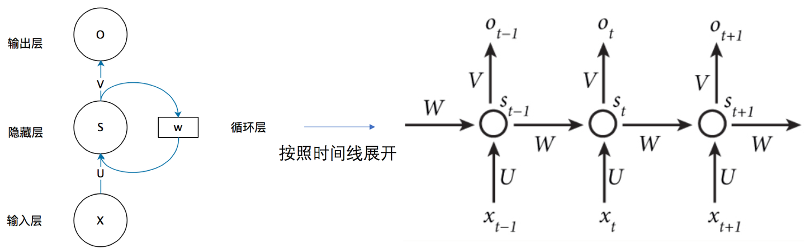

# RNN（循环神经网络）

一种专门设计用来处理序列数据的神经网络架构。

## CNN处理序列数据的问题

- 输入输出长度固定：传统网络的输入和输出大小是预先定义好的。但序列的长度往往是变化的。
- 无视顺序依赖：传统网络将整个输入一次性处理，无法捕捉序列中的顺序信息。打乱一句话的词语顺序，可能得出相同的结果，这是不合理的。
- 缺乏“记忆”：传统网络再处理当前输入时，不会记住之前见过什么。

## 序列数据

元素之间存在前后顺序依赖关系的数据。例如：

- 时间序列：股票价格、天气数据、传感器读数（时间上的顺序）
- 自然语言：一句话、一篇文章（词语上的顺序）
- 视频：连续的帧（图像上的顺序）
- 音频：声音信号（时间上的顺序）

## 核心结构

### 循环结果与“记忆”概念

简单的循环神经网络：



RNN的关键在于它有一个循环连接，允许信息从一个时间步传递到下一个时间步。将上一时间步的隐藏状态与当前输入结合，形成对序列依赖关系的建模能力。本质是通过参数共享实现对时间维度的特征提取，数学公式为：

计算新的隐藏状态：
$$s_t = f(Ux_t + Ws_{t-1} + b_h) （1）$$

展开循环神经网络：

神经网络在t时刻接收到输入$x_t$之后，隐藏层的值是$s_t$，输出值是$o_t$。$s_t$的值不仅取决于$x_t$还取决于$s_{t-1}$。


- $U：输入$x_t$的权重矩阵$
- $x_t$：当前时间步输入向量
- $W$：是连接上一个隐藏状态$s_{t-1}$的权重矩阵。
- $s_{t-1}$：上一时间步隐藏状态
- $f$：激活函数（通常为tanh或sigmoid）

计算输出：
$$y_t = g(Vs_t + b_y) （2）$$

- $V$：是连接上一个隐藏状态$s_{t-1}$的权重矩阵。
- $b$：是偏置项。
- $g$：输出层的激活函数，取决于任务。多分类用softmax，回归用线性函数。

把式1带入到式2，得到：
$$y_t=g(Vf(Ux_t + Ws_{t-1} + b_h) + b_y)
= g(Vf(Ux_t + Wf(Ux_t + Ws_{t-2} + b_h) + b_h) + b_y)
$$

### 前向传播与损失

对于序列$x_{1:T}$通常定义时间步损失之和：
$$L=\sum_{t=1}^T l(y_t, \hat{y_t})$$

### BPTT（Backpropagation Through Time）

把RNN在时间上展开成深度网络，对每个参数按链式法则累积来自所有时间步的梯度。长期依赖导致梯度可能消失或爆炸。

$$\delta_t = \frac{\delta L}{\delta h_t} \in R^{d_h}$$

#### 梯度消失/爆炸

多次相乘的梯度因子（雅可比矩阵的特征值）会指数级缩小或放大。

解决方法：

- 使用门控结构（LSTM/GRU）来学习保留/忘记信息。
- 梯度裁剪（gradient clipping）防止爆炸。
- 用ReLU、残差或正交初始化减缓问题。
- 层归一化（LayerNorm）或权重规范化。

## 代码实现

### 基本RNN

```python
import torch
import torch.nn as nn
import torch.optim as optim
import numpy as np
import matplotlib.pyplot as plt


torch.manual_seed(42)

class SimpleRNN(nn.Module):
    def __init__(self, input_size, hidden_size, output_size, num_layers=1):
        """
        简单的RNN模型

        参数：
        - input_size: 输入特征维度
        - hidden_size: 隐藏层维度
        - output_size: 输出维度
        - num_layers: RNN层数
        """
        super(SimpleRNN, self).__init__()
        self.hidden_size = hidden_size
        self.num_layers = num_layers
        # 定义RNN层
        self.rnn = nn.RNN(
            input_size=input_size,
            hidden_size=hidden_size,
            num_layers=num_layers,
            batch_first=True, # 输入形状为（batch, seq, feature）
            nonlinearity='tanh'
        )
        # 定义输出层
        self.fc = nn.Linear(hidden_size, output_size)

    def forward(self, x):
        """
        前向传播
        
        参数:
        - x: 输入张量，形状为 (batch_size, seq_len, input_size)
        
        返回:
        - output: 最后一个时间步的输出
        """
        h0 = torch.zeros(self.num_layers, x.size(0), self.hidden_size)

        # RNN前向传播
        # out： (batch_size, seq_len, hidden_size) 所有时间步的输出
        # hn：（num_layers, batch_size, hidden_size）最后一个时间步的隐藏状态
        out, hn = self.rnn(x, h0)
        # 只取最后一个时间步的输出
        out = self.fc(out[:, -1, :])
        return out

input_size = 10
hidden_size = 20
output_size = 1
num_layers = 2

rnn_model = SimpleRNN(input_size, hidden_size, output_size, num_layers)
print(rnn_model)

# 测试模型
batch_size = 3
seq_len = 5
test_input = torch.randn(batch_size, seq_len, input_size)
output = rnn_model(test_input)
```

### RNN单元

```python
class RNNCell(nn.Module):
    def __init__(self, input_size, hidden_size):
        super(RNNCell, self).__init__()
        self.input_size = input_size
        self.hidden_size = hidden_size
        # 权重参数
        self.W_xh = nn.Linear(input_size, hidden_size) # 输入到隐藏层的权重
        self.W_hh = nn.Linear(hidden_size, hidden_size) # 隐藏层到隐藏层的权重
        self.tanh = nn.Tanh()

    def forward(self, x, h_prev):
        h_next = self.tanh(self.W_xh(x) + self.W_hh(h_prev))
        return h_next

class ManualRNN(nn.Moudle):
    def __init__(self, input_size, hidden_size, output_size):
        super(ManualRNN, self).__init__()
        self.input_size = input_size
        self.rnn_cell = RNNCell(input_size, output_size)
        self.fc = nn.Linear(hidden_size, output_size)

    def forward(self, x):
        batch_size, seq_len, input_size = x.shape
        # 初始化隐藏状态
        h = torch.zeros(batch_size, self.hidden_size)
        
        # 按时间步循环
        for t in range(seq_len):
            h = self.rnn_cell(x[:, t, :], h)
        
        # 使用最后一个隐藏状态进行预测
        output = self.fc(h)
        return output

# 测试手动实现的RNN
manual_rnn = ManualRNN(input_size, hidden_size, output_size)
manual_output = manual_rnn(test_input)
print(f"手动实现RNN输出形状: {manual_output.shape}")
```
