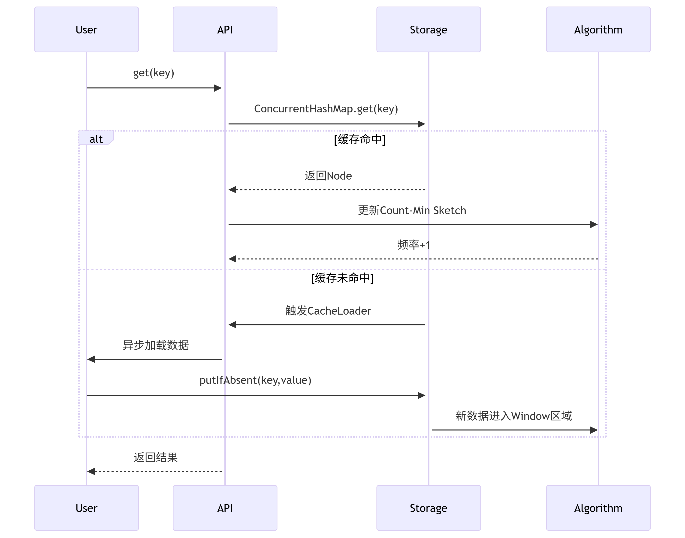
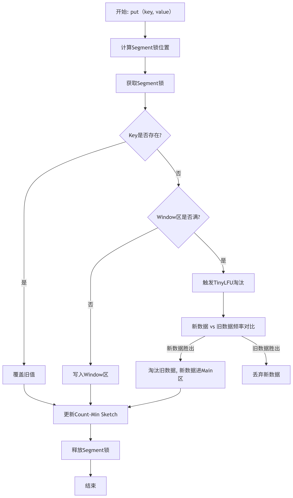

# Caffine缓存

Caffine是一个高性能的本地缓存库，广泛应用于Java应用程序中。基于Java8开发，提供了接近理论最优的缓存命中率，并且在并发场景下表现出色。

## 核心特性

- 高性能：Caffine使用了Window TinyLFU（W-TinyLFU）算法，结合了LRU（最近最少使用）和LFU（最少使用频率）的优点，提供更高的缓存命中率。
- 多种淘汰策略：
  - 基于大小：设置最大缓存条目数，超出时淘汰。
  - 基于时间：支持基于写入时间或访问时间的过期策略。
  - 基于引用：支持弱引用或软引用，便于垃圾回收。
- 支持异步加载缓存，适合高并发场景。
- 统计功能：内置统计功能，可以监控缓存命中率、加载时间等指标。
- 轻量级：占用内存小，适合本地缓存场景。

## 架构设计

Caffine底层采用优化的ConcurrentHashMap作为主要存储结构，并在此基础上进行多项创新：

- 分段存储技术：使用StripedBuffer实现无锁化并发控制，将竞争分散到多个独立缓冲区，显著提升并发吞吐量。
- 频率统计机制：采用Count-Min Sketch（频率矩阵）算法记录访问频率，以93.75%的准确率仅使用少量内存空间。
- 时间轮结构：使用TimerWheel数据结构高效管理过期条目，实现纳秒级精度的过期控制。

### 存储结构实现

ArrayDeque + ConcurrentHashMap

分段锁设计：

- Caffine将缓存分成多个段（默认16段），每个段对应一个Segment对象。
- 每个Segment包含：
  - count：段内条目数（原子变量）。
  - map：ConcurrentHashMap存储键值对。
  - queue：ArrayDeque维护访问顺序（用于淘汰算法）。

## 淘汰策略

Caffine使用了Window TinyLFU（W-TinyLFU）算法，结合了LRU和LFU的优点：

- 三区设计：窗口区（20%）、试用区（1%）和主区（79%），各区使用LRU双端队列管理。
- 动态调整：根据访问模式自动调整各区比例，最高可实现98%的缓存命中率。
- 频率衰减：通过周期性衰减历史频率，防止旧热点数据长期占据缓存。

### 淘汰算法

- 双队列设计：
  - 访问队列（Access Queue）：记录所有访问过的键，按时间排序。
  - 频率队列（Frequency Queue）：统计键的访问频率，分为低频（LFU）和高频（MFU）区域。
- 时间窗口机制：通过滑动窗口（默认1分钟）过滤陈旧访问记录，避免历史数据影响当前数据统计。
- 缓存晋升策略：
  1. 新键首先存入“probation队列”（试用区），防止偶发访问的键占用过多的空间。
  2. 当键访问的次数超过阈值（默认2次），晋升至“main队列”（主区）。

## 读写流程

### 读流程

1. 用户调用 cache.get('key')；
2. 查ConcurrentHashMap，如果命中，返回数据并给访问频率+1；
3. 如果未命中，就调用 CacheLoader.load('A') 加载数据；
4. 数据加载后：
    - 写入ConcurrentHashMap
    - 更新Count-Min Sketch（频率+1）
5. 返回数据。

### 写流程

1. 调用 cache.put(key, value)
2. 锁获取：根据key.hashCode()计算对应的Segment锁。
3. 锁内操作：
   1. 检查key是否已存在：存在->覆盖旧值；不存在->进入Window-TinyLFU淘汰逻辑；
   2. 检查Window区是否已满；未满->直接写入Window区；已满->触发淘汰流程；
      1. 对比新数据与Window中最旧数据的频率素描计数；
      2. 新数据频率更高->淘汰旧数据，新数据进入Main区。
      3. 旧数据频率更高->丢弃新数据。
4. 更新元数据：
   1. 更新 Count-Min Sketch 频率计数；
   2. 记录访问时间戳（LRU逻辑）。
5. 释放锁：完成写入。

## 并发控制机制

- 写缓冲机制：使用RingBuffer和MpscChunkedArrayQueue实现多生产者单消费者队列。
- 乐观锁优化：通过ReadAndWriteCounterRef等自定义原子引用降低CAS开销。
- StampedLock应用：在关键路径上使用Java8的StampedLock替代传统锁，提升并发性能。

## 适用场景

- 本地缓存：需要快速访问数据的场景，例如用户会话、配置信息等。
- 高并发：多线程环境下，Caffine的性能优于Guava Cache。
- 低延迟：本地缓存避免了网络调用，适合对延迟敏感的应用。

## 缓存一致性

在实际业务中，通常会组合使用本地缓存（Caffine）和分布式缓存（Redis）以兼顾性能和数据一致性。

### 实现缓存一致性的方法

1. 发布订阅机制（pub/sub）

    利用Redis的发布订阅功能，当Redis缓存更新的时候，发布消息通知所有应用节点更新本地缓存数据。

    实现步骤：
    1. 在Redis中为每个需要同步的缓存键设置一个发布频道（例如cache-update:product:123）。
    2. 当Redis中的数据更新时，发布一条消息到对应频道，消息内容包含缓存键和操作类型（更新或删除）。
    3. 每个应用节点订阅这些频道，收到消息后更新或删除本地的Caffine缓存。

    **优点**：
    - 实时性高，更新传播快。
    - 适合分布式系统，节点解耦。

    **缺点**：
    - 依赖Redis的Pub/Sub性能。
    - 网络抖动可能导致消息丢失。

2. 主动刷新

    在每次访问Caffine缓存时，检查Redis中的数据是否更新，如果更新的话同步到本地缓存中。

    实现步骤：
    1. 为每个缓存键中Redis中存储一个版本号（例如product:123:version）。
    2. 在Caffine缓存中存储数据时，同时存储版本号。
    3. 每次读取Caffine缓存时，比较本地版本号和Redis版本号。
      - 如果版本号一致，直接返回数据。
      - 如果版本号不一致，从Redis加载最新数据并更新Caffine缓存。

    **优点**：
    - 实现简单，无需额外组件。
    - 适合读多写少的场景。

    **缺点**：
    - 每次读取都需要访问Redis，影响性能。
    - 不适合高并发场景。

3. 定时同步

    定期检查Redis缓存中的数据，将更新的数据同步到Caffine缓存。

    实现步骤：
    1. 启动一个定时任务（例如每分钟执行一次）。
    2. 扫描Redis中的缓存键，检查版本号或时间戳。
    3. 将有更新的键同步到Caffine缓存。

    **优点**：
    - 实现简单，适合更新不频繁的场景。
    - 减少对Redis的频繁访问。

    **缺点**：
    - 存在同步延迟，可能读取到旧数据。
    - 扫描所有键可能影响性能。

在实际生产环境中，结合发布订阅机制和主动刷新：

- 使用Redis发布订阅实现实时更新，覆盖大部分场景。
- 对于可能的消息丢失或网络问题，辅以主动刷新机制，确保数据最终一致性。
- 定时同步作为兜底方案，处理异常情况。

## 业务场景

假设一个电商平台，实现商品详情页的缓存机制。商品信息（价格、库存、促销状态）保存在MySQL中，为了提升性能，使用Redis作为分布式缓存，Caffine作为应用内的本地缓存。商品信息可能因为促销活动或库存变化而频繁更新，需要保证用户看到的商品信息是最新的。

需求：

- 商品详情页的响应时间控制在50ms内。
- 缓存数据与数据库保持一致，更新延迟不超过1秒。
- 系统支持高并发，每天处理千万级请求。

问题一：设计一个缓存方案，确保商品详情页的数据一致性，并应对高并发。

回答：

1. 缓存结构：
   1. Caffine本地缓存：每个应用节点维护一个Caffine缓存，存储热点商品的详细信息，设置最大条目为10000，写入后5分钟过期。
   2. Redis分布式缓存：存储所有商品信息，设置1小时过期时间，并为每个商品维护一个版本号（例如product:123:version）。
   3. MySQL作为数据源，存储所有商品信息。
2. 数据读取流程：
   1. 先查询Caffine缓存：
      1. 如果命中，检查缓存中版本号与Redis中的版本号是否一致。
      2. 如果一致，直接返回缓存数据。
      3. 如果版本号不同或缓存未命中，从Redis加载数据，更新Caffine缓存。
   2. 查询Redis，如果未命中，从MySQL中读取数据，更新Redis缓存和Caffine缓存。
3. 数据更新流程：
   1. 当商品信息更新时（例如库存减少、价格调整）：
      1. 先更新MySQL数据库。
      2. 更新Redis中的商品数据，并递增版本号。
      3. 通过Redis的Pub/Sub发布更新消息（cache-update:product:123:update）。
   2. 各应用节点订阅消息，收到后更新或删除Caffine缓存。
4. 一致性保障：
   1. 使用Pub/Sub实现实时更新，更新延迟通常在100ms以内。
   2. 每30秒执行一次定时任务，扫描Redis中的版本号，同步有变化的商品到Caffine缓存，确保异常情况下数据一致。
   3. 对于高并发，Caffine的高性能保证本地缓存的读取速度，Redis的集群部署支持分布式扩展。
5. 性能优化：
   1. 使用批量加载（cache.getALL）减少Redis查询次数。
   2. 对热点商品设置更短的过期时间（例如1分钟），避免缓存过旧数据。
   3. 监控Caffine的命中率和Redis的QPS，动态调整缓存大小和过期时间。

问题二：如果Redis宕机了，该方案会受到什么影响？

回答：

如果宕机会导致以下问题：

- Caffine缓存无法验证版本号，可能返回过旧数据。
- 新数据无法写入Redis，影响其他节点的数据同步。

应对措施：

1. 降级处理：在Redis不可用时，直接从MySQL加载数据，更新Caffine缓存。虽然性能下降，但保证数据正确性。
2. 本地回退：Caffine缓存设置较短的过期时间，即使Redis宕机，旧数据也会很快过期。
3. 哨兵机制：部署Redis哨兵或集群，确保高可用，降低宕机概率。
4. 监控告警：实时Redis监控，一旦宕机，立即切换到备用Redis实例。

问题三：如果某个商品的访问量激增，可能导致缓存被击穿，该如何处理？

回答：

缓存击穿是因为热点数据过期或未缓存，导致大量请求直接访问数据库，按一下方式解决：

1. 热点缓存：在Caffine中为热点数据设置更长的过期时间，并通过统计访问频率动态调整。
2. 异步刷新：当缓存即将过期时，异步线程提前从Redis或MySQL刷新缓存，避免大量请求穿透。
3. 布隆过滤器：在Redis中使用布隆过滤器，快速判断商品是否在缓存中，减少无效查询。
4. 限流熔断：对数据库查询设置限流，防止高并发压垮数据库，同时返回默认值或提示用户稍后重试。

问题四：方案如何验证效果？有哪些监控指标？

回答：

1. 验证方法：
   1. 功能测试：模拟商品更新，检查Caffine和Redis是否同步，延迟小于1秒。
   2. 压力测试：使用JMeter模拟高并发请求，验证响应时间是否在50ms以内。
   3. 一致性测试：对比MySQL、Redis和Caffine的数据，确保一致性。
2. 监控指标：
   1. Caffine命中率：目标95%以上，低命中率可能需要增加缓存大小。
   2. Redis QPS：监控Redis请求量，防止过载。
   3. 响应时间：统计商品详情页的P99响应时间，确保小于50ms。
   4. 一致性延迟：记录Pub/Sub消息从发布到Caffine更新时间。
   5. 错误率：监控Redis查询失败、MySQL查询超时等异常。
