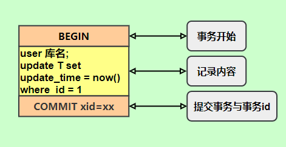
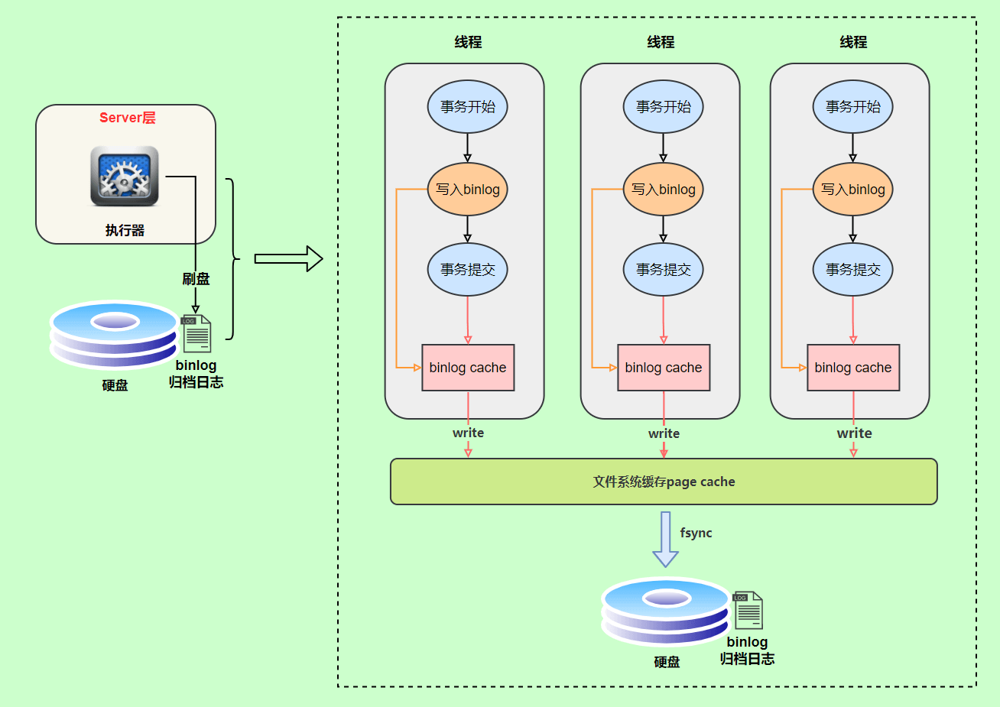
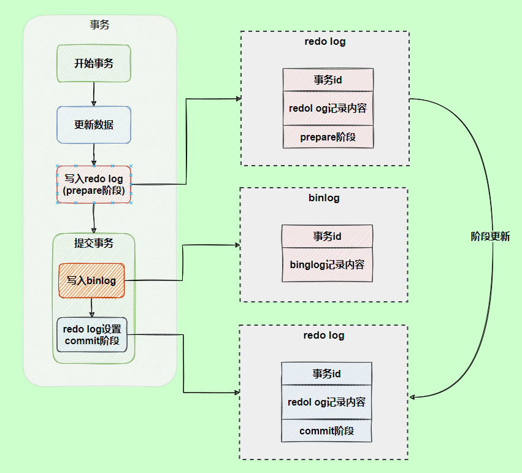
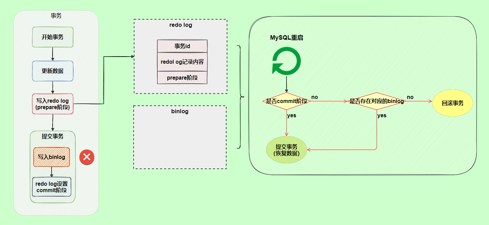
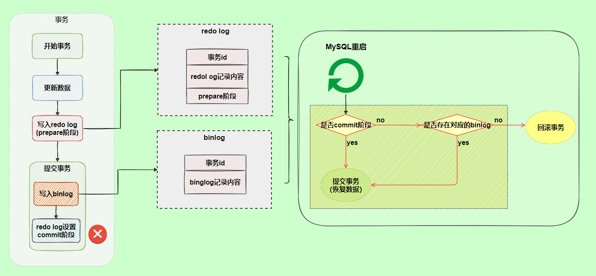

# MySQL日志

## RedoLog

redo log（重做日志）是InnoDB存储引擎独有的，让MySQL拥有了崩溃恢复能力。保证数据的持久性与完整性。
MySQL中数据是以页为单位存储的，查询一条记录，就会从硬盘把一页的数据加载出来，加载出来的数据叫数据页，会放到Buffer Pool中。
后续的查询都从Buffer pool中找，没有命中再去硬盘加载，减少硬盘IO开销，提升性能。更新表数据时，如果发现Buffer pool中存在要更新的数据，就直接在Buffer poll里更新。
然后再把在某个数据页上做了什么修改记录到重做日志缓存里(redo log buffer)里，接着刷盘redo log 文件里。

### RedoLog刷盘时机

1. 事务提交：当事务提交时，log buffer里的redo log会被刷新到磁盘（通过 innodb_flush_log_at_trx_commit 参数控制）
2. log buffer空间不足时：log buffer 中缓存的redo log已经占满log buffer总容量的一半左右，就需要把这些日志刷新到磁盘上。
3. 事务日志缓冲区满：InnoDB使用一个事务日志缓冲区来暂时存储事务的重做日志条目。当缓冲区满时，会触发日志的刷新，将日志写入磁盘。
4. Checkpoint（检查点）：InnoDB会定期执行检查点操作，将内存中的脏数据（已经修改但是未写入磁盘的数据）刷新到磁盘，并且会将相应的重做日志一同刷新，以确保数据的一致性。
5. 后台刷新线程：InnoDB启动了一个后台线程，负责周期性（每隔1秒）地将脏页（已修改但尚未写入磁盘的数据）刷新到磁盘，并将相关的重做日志一同刷新。
6. 正常关闭服务器：MySQL关闭的时候，redo log都会刷新到磁盘中。

### 刷盘策略

刷盘策略 **innodb_flush_log_ta_trx_commit** 的默认值为1，设置为1时不会丢失任何数据，为了保证事务持久性，必须将其设置为1。

1. 0：设置为0的时候，表示每次事务提交时不刷新磁盘。这种方式性能最高，但是最不安全。MySQL挂了或宕机，可能会丢失最近1秒内的事务。
2. 1：设置为1的时候，表示每次事务提交时都将进行刷盘操作。这种方式性能最低，但是也安全，因为只要事务一提交，redolog就会记录在磁盘中，不会有任何数据丢失。
3. 2：设置为2的时候，表示每次事务提交都只把log buffer里的redo log内容写入page cache（文件缓存系统）。page cache是专门用来缓存文件的，这里被缓存的文件就是redo log文件。
这种方式的性能介于两者之间。

InnoDB存储引擎有一个后台线程，每隔1秒就会把redo log buffer中的内容写到文件缓存系统中（page cache），然后调用fsync刷盘。

## BinLog

binlog是逻辑日志，记录内容是语句的原始逻辑，并且是顺序写。属于MySQL server层，无论使用什么存储引擎，只要发生了表数据更新，就会产生binlog日志。

MySQL 数据库的数据备份、主备、主主、主从都离不开 binlog，需要依靠 binlog 来同步数据，保证数据一致性。

### 记录格式

binlog日志有三种格式，可以通过 binlog_format参数来指定。

1. **statement**

    指定statement格式，记录的内容是SQL语句原文，比如执行一条语句update table set update_time=now() where id = 1;记录格式如下：
    

    当同步数据时会执行SQL语句，但是有个问题，执行语句会获取系统时间，就会导致同步数据不一致问题发生。

2. **row**

    row记录的不再是简单的sql语句，还包含具体的操作数据，这样就能保证同步数据一致性，通常情况下都指定为row。row格式记录的数据看不到详细信息，需要使用mysqlbinlog工具解析出来。
    但是这种格式需要更大的容量空间来存储，恢复与同步时会更消耗IO资源，影响执行速度。

3. **mixed**

    记录的内容是前两者的混合。MySQL会判断这条sql语句是否会引起数据不一致，如果会就使用row格式，如果不会就使用statement格式。

### binlog写入机制

事务执行过程中，先把日志写到binlog cache，事务提交的时候再把binlog cache写到binlog文件中。因为一个事务的binlog不能被拆开，所以无论这个事务有多大，mysql都会给每个线程分配一个binlog cache。可以通过binlog_cache_size来控制单个线程binlog cache大小，如果存储内容大小超过了这个设置，就要暂存到磁盘。

上图的write是指把日志写入文件系统的page cache中，并没有把数据持久化到磁盘，所以比较快。fsync才是将数据持久化到磁盘。

write和fsync的时机可以通过sync_binlog参数来控制，默认是1，表示每次事务提交都会执行fsync，如同redo log日志刷盘流程一样。为0的时候表示每次事务提交的时候都只write，由系统来判断什么时候执行fsync。虽然性能得到提升，但是机器宕机，page cache中的数据会丢失。最后还有一种折中的方案，即设置为N（N>1），表示每次提交事务都write，累计达到N个事务提交时执行fsync。在出现IO瓶颈的场景里，设置比较大的sync_binlog可以提升性能。

### 两阶段提交

redolog（重做日志）日志让InnoDB存储引擎拥有了崩溃恢复的能力。binlog（归档日志）保证了MySQL集群架构的数据一致性。虽然都属于持久化的保证，但是侧重点不同。在执行语句的过程中会记录redolog和binlog日志，以基本的事务为单位，redolog可以在事务的执行过程中源源不断的写入，而binlog日志需要在事务提交时才写入，所以两者的写入时机不一样。如果两份日志记录的逻辑不一样会发生什么问题。

例如一条更新语句，在执行过程中完成了redolog的写操作，但是在事务提交时写binlog发生了异常导致写入失败，那么binlog日志里就没有这条修改记录，备库在根据binlog恢复数据的时候，就会少一次更新，而主库因为redolog日志恢复有这一次的更新记录，导致了最终数据不一致。

为了解决两份日志不一致的问题，InnoDB存储引擎采用了两阶段提交方案。原理就是将redolog的写入拆成了两个步骤prepare和commit。

使用两阶段提交后，写入binlog发生异常也不会有影响，因为MySQL根据redolog日志恢复数据时，发现redolog还处在prepare阶段，并且没有对应的binlog日志，就会回滚该事务。

而在commit阶段发生异常时，并不会回滚事务，虽然redolog处于prepare阶段，但是能通过事务id找到对应的binlog日志，所以mysql认为事务是完整的，就会提交事务恢复数据。

## undo log

每一个事务对数据的修改，都会被记录到undo log，当事务执行过程中出现错误或需要回滚时，MySQL可以根据undo log将数据恢复到事务开始前的状态。

undo log是逻辑日志，记录的是SQL语句。比如事务执行一条DELETE操作，那么undo log就会记录一条INSERT语句。同时undo log的信息也会被记录到redo log中，因为undo log也要实现持久性保护。并且undo log是会被清理的，例如INSERT操作，在事务提交之后就可以清除掉了；UPDATE/DELETE操作在事务提交不会立即清理，会加入history list，由后台线程purge来清除。

undolog是采用segment（段）的方式来记录的，每个undo操作在记录的时候占用一个undo log segment（undo日志段），undo log segment包含在一个rollback segment（回滚段）中。事务开始时需要为其分配一个rollback segment。每个rollback segment有1024个undo log segment，便于管理多个并发事务的回滚操作。

rollback segment header是rollback segment的一部分（通常在rollback segment的第一个页）负责管理rollback segment。history list是rollback segment header的一部分，主要作用是记录所有已经提交但是还没被清理（purge）的事务的undo log。这个列表使得purge线程能够找到和清理那些不再需要的undo log记录。

另外MVCC的实现依赖于：隐藏字段、Read View、undo log。InnoDB通过隐藏字段DB_TRX_ID和Read View来判断数据的可见性，如不可见，则通过数据行的DB_ROLL_PTR找到undo log中的历史版本。每个事务读到的数据版本可能不一样，在一个事务中，用户只能看见该事务创建Read View之前已经提交的和本事务做的修改。
