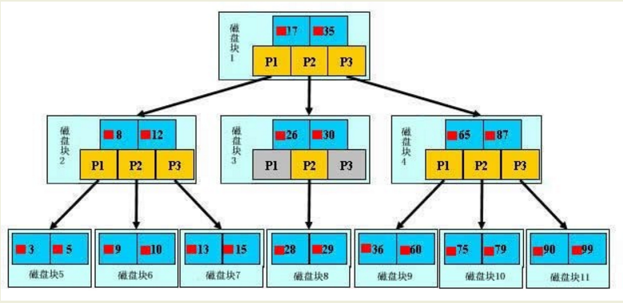
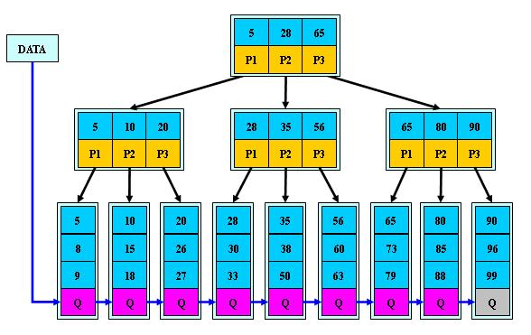

# MySQL索引

索引是在存储引擎层实现的，而不是在服务器层实现的。

## 数据结构

### B-树索引

如果要查找数据项29，首先会把磁盘块1由磁盘加载到内存，此时发生一次IO，在内存中用二分查找确定29在17和35之间，锁定磁盘块1的P2指针，通过磁盘1的P2指针的磁盘地址把磁盘块3由磁盘加载到内存，发生第二次IO，29在26和30之间，锁定磁盘块3的P2指针，通过加载磁盘块8到内存，发生第三次IO，同时做二分查找找到20。

### B+树

B+树是一棵平衡二叉树，主索引的叶子节点冗余了完整的数据记录，叶子节点之间还是用指针相关联起来的，查找的时候在根节点进行二分查找，找到一个key所在的指针，然后在指针所指向的节点进行查找，直到查找到叶子节点，然后在叶子节点上进行二分查找，找出key所对应的data。插入和删除操作会破坏平衡树的平衡性，在插入删除操作之后需要对树进行分裂、合并、旋转等操作。

### 哈希索引

哈希索引能以O（1）的时间复杂度进行查找，但是失去了有序性，并且无法进行排序与分组和范围查询，只能进行精确查找。InnoDB存储引擎有一个特殊的功能叫“自适应哈希索引”，当某个索引值被使用的非常频繁时，会在B+Tree索引之上再创建一个哈希索引，这样就让B+Tree索引具有哈希索引的一些优点，比如快速的哈希查找。

### 全文索引

MYISAM存储引擎支持全文索引，用于查找文本中的关键词，而不是直接比较是否相等，查找条件使用MATCH AGAINST，而不是普通的WHERE。

### 空间存储索引

MYISAM存储引擎支持空间数据索引（R-Tree），可以用于地理数据存储。空间数据索引会从所有纬度来索引数据，可以有效地使用任意维度来进行组合查询。

### 索引优缺点

1. 优点：
   - 提高数据检索的效率，降低数据库的IO成本。
   - 通过索引列对数据进行排序，降低数据排序的成本，降低了CPU的消耗。
2. 缺点：
   - 虽然索引提高了查询速度，同时却会降低更新表的速度，如对表进行INSERT、UPDATE、DELETE。更新表时，Mysql不仅要保存数据，还要保存一下索引文件每次更新
   - 添加了索引列的字段，都会调整因为更新所带来的键值变化后的索引信息。

### B-Tree与B+Tree的区别

1. B-树的关键字和记录放在一起，B+树的非叶子结点中只有关键字和指向下一个节点的索引，记录只放在叶子节点中。
2. 在B-树中，越靠近根节点的记录查找时间越快，只要找到关键字即可确定记录的存在；而B+树中每个记录的查找时间基本是一样的，都需要从根节点走到叶子节点，而且在叶子节点中还要再比较关键字。因为B+树的非叶子结点不存放实际的数据，这样每个节点可容纳的元素个数比B-树多，树高比B-树小，减少了磁盘访问次数。尽管B+树找到一个记录所需的比较次数比B-树多，但是一次磁盘访问的时间相当于成百上千次的内存比较时间。B+树的叶子节点使用指针连接在一起，方便顺序遍历。
3. B+树内节点不存储数据，所有data存储在叶节点导致查询时间复杂度固定为O(logn)，而B树每个节点都有key和data，查询时间复杂度不固定，与key在树中的位置有关，最好为O(1)。
4. B+树节点两两相连，而且在磁盘里是顺序存储的，当读到某个值的时候，磁盘预读原理会提前把这些数据读进内存，可大大增加区间访问性，可使用在范围查询等，而B树每个节点key和data在一起，无法区间查找。（空间局部性原理：如果一个存储器的某个位置被访问，那么它附近的位置也会被访问。）
5. B+树更适合外部存储。由于节点内无data域，每个节点能索引的范围更大更精确。由于B树的节点内部每个key都带有data，而B+树只存key的副本，真实的key和data都存在叶子结点上。磁盘是分block的，一次磁盘IO会读取若干个block，磁盘IO的大小是固定的，在一次IO中，单个元素越小，量就越大。也就是B+树单次IO的信息量大于B树，能读出的索引值更多。

### 索引维护

B+树为了维护索引有序性，在插入新值的时候需要做必要的维护。

1. 如果新插入的id在后面，直接插入就行，如果在中间，需要挪动后面的数据，空出位置。
2. 如果所在的数据页满了，根据B+树算法，需要申请一个新的数据页，然后挪动部分数据过去，这个过程称为页分裂。页分裂还影响数据页的利用率，原本放在一个页的数据，现在分到两个页中，整体空间利用率降低大约50%。
3. 当相邻两个页由于删除了数据，利用率很低之后，会将数据页做合并，合并的过程可以认为是分裂过程的逆过程。

### 覆盖索引

如果需要查询的字段是索引字段，此时可以直接提供查询结果，不需要回表。这个称为覆盖索引。覆盖索引可以减少树的搜索次数，显著提升查询性能，所以使用覆盖索引是常用的优化手段。

### 最左前缀原则

在联合索引中，如果查询条件是联合索引中的一部分，会优先从联合索引的左边开始匹配，查询数据时，一个字段匹配上之后再继续匹配下一个字段。在建立联合索引的时候，如果通过调整顺序，可以少维护一个索引，那么这个顺序就是需要优先考虑采用的。

## 索引建立原则

1. 选择唯一性索引

    唯一性索引的值是唯一的，可以更快速的通过该索引来确定某条记录。例如，学生表中的学号。

2. 为经常需要排序、分组和联合操作的字段建立索引

    经常需要ORDER BY、GROUP BY、DISTINCT和UNION等操作的字段，排序会浪费很多时间。

3. 为常作为查询条件的字段建立索引

    如果某个字段经常用来做查询条件，那么该字段的查询速度会影响表的查询速度。

4. 限制索引数目

    每个索引都需要占用磁盘空间，索引越多，需要的磁盘空间就越大。修改表时，对索引的重构和更新很麻烦。

5. 尽量使用数据量少的索引

    如果索引的值很长，查询的速度会受到影响。例如，对一个char(100) 类型的字段进行全文检索需要的时间肯定要比CHAR(10)类型的字段需要的时间长。

6. 尽量使用前缀索引

    如果索引字段的值很长，最好使用前缀来索引。

7. 删除不再使用或者很少使用的索引

    表中的数据被大量更新，或者数据的使用方式被改变后，原有的一些索引可能不再需要。

8. 最左前缀匹配原则

    mysql会一直向右匹配直到遇见范围查询（>、<、between、like）就停止匹配。例如，a=1 and b=2 and c>3 and d=4，如果建立(a,b,c,d)顺序的索引，d就用不到索引，如果是(a,b,d,c)的索引则都可以用到，a,b,d的顺序可以任意调整。

9. =和in可以乱序

    比如a=1 and b=2 and c=3建立(a,b,c)可以任意顺序，mysql查询优化器会优化成索引可以识别的形式。

10. 尽量选择区分度高的列作为索引

    区分度的公式是count(distinct col)/count(*)，表示字段不重复的比例，比例越大扫描的记录数越少，唯一键的区分度是1。

11. 索引列不能参与计算，保持列“干净”。

    比如from_unixtime(create_time)='2022-06-14'就不能使用索引，b+树中存的都是数据表中的字段值，但进行检索时，需要把所有元素都应用函数才能比较，所以应该写成
    create_time=unix_timestamp('2022-06-14')。

12. 尽量扩展索引，不要新建索引。

    比如表中已经有a的索引，现在要加(a,b)的索引那么只需要修改原来的索引即可。

13. 当单个索引字段查询数据很多，区分度不大时，则需要考虑建立联合索引来提高查询效率。
