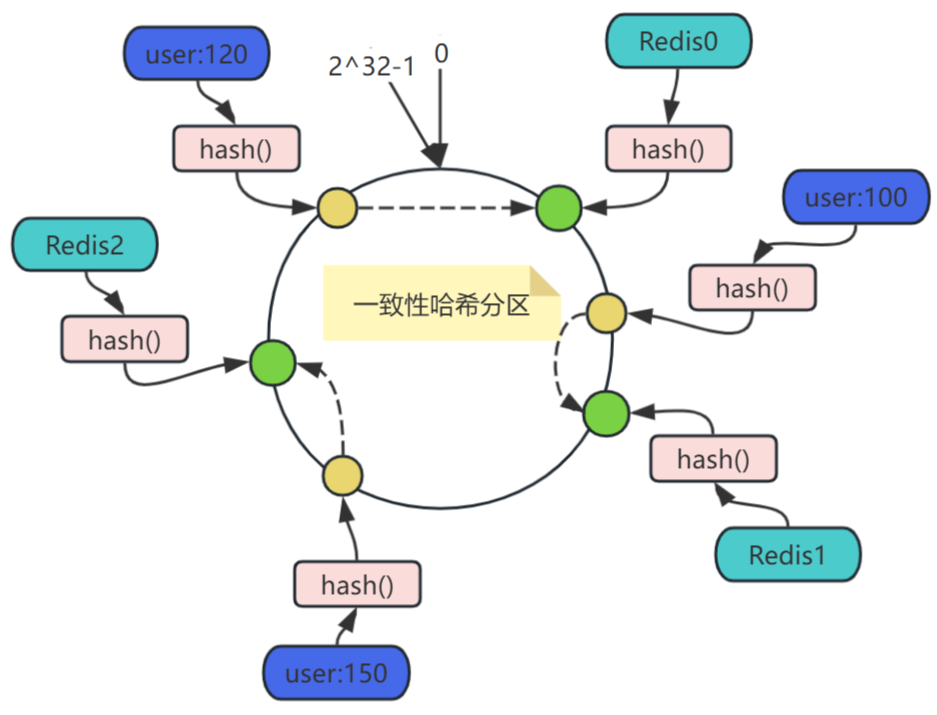
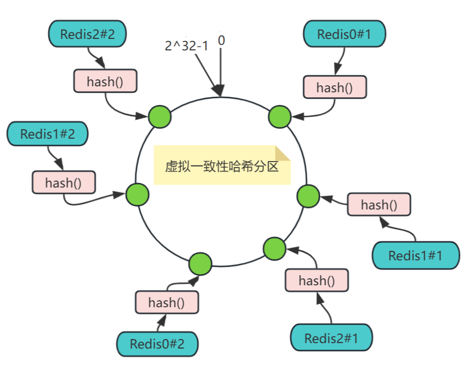
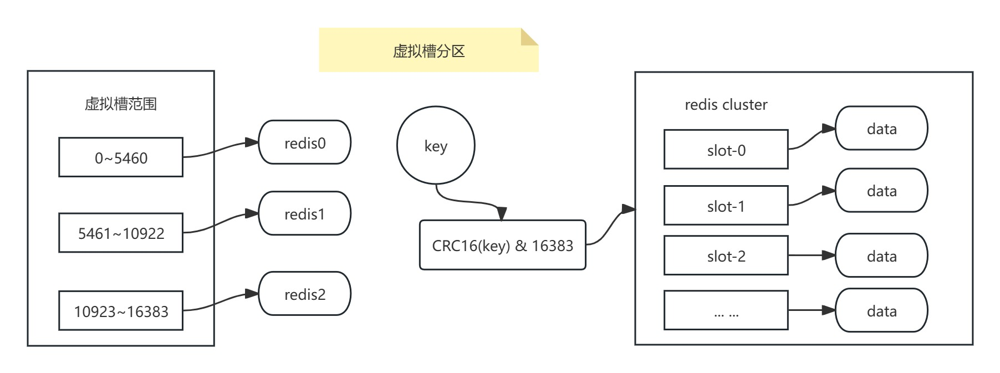

# Redis分布式

## Redis分布式锁

学习链接 http://kaito-kidd.com/2021/06/08/is-redis-distributed-lock-really-safe/

### 定义

分布式锁是控制分布式系统或不同系统之间共同访问共享资源的一种锁实现，如果不同的系统或同一个系统的不同主机之间共享了某个资源时，往往需要互斥来防止彼此干扰保证一致性。

### 特征

- 互斥性。互斥是锁的基本特征，同一时刻只能被一个线程持有，执行临界区操作。
- 超时释放。通过超时释放可以避免死锁，防止不必要的线程等待和资源浪费。
- 可重入性。一个线程在持有锁的情况可以对其再次请求加锁，防止锁在线程执行完临界区操作之前释放。
- 高性能和高可用。加锁和释放锁的过程性能开销要尽可能的低，同时也要保证高可用，防止分布式锁意外失效。

### 基于Redis单机实现的分布式锁

1. 使用 SETNX 命令

    只在key不存在的情况下，将key的设置为value，若key已经存在，则SETNX命令不执行操作。比如在秒杀活动中对某一商品加锁，key可以按照需要锁定的业务命名，value可以为任意值，在资源使用完成后，使用DEL删除该key对锁进行释放。但存在一个问题，如果获得锁的进程在业务逻辑处理过程中出现了异常，可能会导致DEL指令无法执行，锁无法释放，资源被永远锁住。所以在使用SETNX拿到锁之后，需要给key设置一个过期时间，使得锁在到达一定时间后可以被自动释放。由于SETNX不支持设置过期时间，所以需要EXPIRE指令去设置过期时间。这样仍然存在问题，SETNX和EXPIRE这两个操作不是原子性的，如果在执行SETNX和EXPIRE之间发生异常，SETNX成功，但EXPIRE没有执行，这把锁依然会永久锁定资源，其他进程无法正常获取锁。

2. 使用 SET 扩展指令

    set key NX EX 10

    - NX表示当key对应的值不存在时才能set成功，保证只有第一个请求的客户端才能获得锁，而其他客户端在锁被释放之前都无法获得锁。
    - EX 10 表示这个锁10秒后会自动过期，可根据业务设置时间的大小。

    但仍然不能解决分布式锁超时的问题：

    - 锁被提前释放。假如线程A在加锁和释放锁之间的逻辑执行时间过长（或是线程A被阻塞），超过了锁的过期时间，导致线程A还没有执行完锁就被释放了，这时候线程B可以获取锁，导致代码不能严格的串行执行。
    - 锁被误删。假如以上A执行完后，并不知道此时B的锁持有者是B，线程A会继续执行DEL指令来删除锁，如果线程B的逻辑没有执行完，线程A实际上就释放了B的锁。

    为避免以上情况，建议不要在执行时间过长的场景中使用Redis分布式锁，并在执行DEL释放锁之前对锁进行判断，验证当前锁的持有者是自己。具体实现就是加锁时，将value设置唯一的值，释放前先判断是不是一致，然后再执行释放操作，确保不会错误释放其他线程持有的锁。但判断value和删除key是两个独立的操作，并不是原子性的，所以需要使用Lua脚本进行处理，因为Lua脚本可以保证连续多个指令的原子性执行。

3. 使用 Redisson 的分布式锁

### 基于Redis多机实现的分布式锁 Redlock

获取锁的过程：

- 获取当前Unix时间，以毫秒为单位。
- 按顺序依次从5个实例使用相同的key和具有唯一性的value获取锁。当向Redis请求锁时，客户端应设置一个网络连接和响应超时时间,这个超时时间应该小于锁的失效时间。可以避免服务器端Redis已经挂掉的情况下，客户端还一直等待响应结果。如果服务器端没有在规定时间内响应，客户端应该尽快尝试去另一个Redis实例请求锁。
- 客户端使用当前时间减去开始获取锁的时间就得到获取锁的时间。当且仅当从大多数（N/2+1）的Redis节点都获得锁，并且使用的时间小于锁失效的时间才算获取成功。
- 如果取到了锁，key的真正有效时间等于有效时间减去获取锁使用的时间。
- 如果因为某些原因，获取锁失败（没有在至少 N/2+1 个Redis实例取到锁或者取锁时间已经超过了有效时间），客户端应该在所有的Redis实例上进行解锁。

## Redis分区

随着请求量和数据量的增加，一台机器已经无法满足需求，就需要把数据和请求分散到多台机器，就需要引入分布式存储。

### 分片方案

#### 范围分区（range partitioning）

也叫顺序分区，最简单的分区方式。通过映射对象的范围到指定的Redis实例来完成分片。

**优点**：

- 键值业务相关。
- 可顺序访问：同一范围内的范围查询不需要跨节点，提升查询速度。
- 支持批量操作。

**缺点**：

- 数据分散度易倾斜。
- 需要一个映射范围到实例的表格。该表需要管理，不同类型的对象都需要一个表，所以范围分片在Redis中并不可取。

#### 哈希区域分区（hash partitioning）

使用一个哈希函数（例如crc32），将key转为一个数字。对该数据进行取模，将其转化为节点个数内的数字，可以映射到相应的节点上。

**优点**：

- 实现简单高效：仅需哈希函数和取模运算即可完成数据分布，适合快速搭建小型分布式系统。
- 负载均衡：数据均分分不到所有节点，每个节点处理固定比例的请求，避免单点过载。

**缺点**：

- 扩容/缩容成本高，节点数量变化时，取模分母变化，导致所有数据需要重新计算映射关系并迁移，引发全量数据洗牌。翻倍扩容可以相对减少迁移量，但是翻倍所需的成本较大。

#### 一致性哈希分区

1. 设计哈希函数Hash(key)，要求取值范围为[0,2^32-1]，将这个取值范围的数字头尾相连形成一个闭合环形，各哈希值在Hash环上按顺时针方向递增。
2. 将Redis节点映射至哈希环，可以通过其IP地址或机器名，经过一个Hash函数计算的结果，映射到哈希环上。
3. 将key映射于哈希环。
4. 将key映射至Redis节点，在对象和节点都映射至同一个哈希环后，要确定某个对象映射至哪个节点，只需从该对象开始，沿着哈希环顺时针方向查找，找到的第一个节点就是。

服务器扩容增加节点时，比如要在Redis1和Redis2之间增加节点Redis3，只会影响新增节点Redis3与上一个（顺时针为前进方向）节点Redis1之间的对象，这些对象的映射关系按照上面的规则，调整至新增的节点Redis3，其他对象的映射关系都无需调整。

**优点**：

- 动态扩展友好：增减节点仅影响相邻节点，迁移量减少至约1/N（N为节点数）。

**缺点**：

- 数据倾斜风险：节点较少时分布不均匀。
- 数据丢失风险：预新增节点与上一个节点之间的数据不可命中，丢失。

#### 虚拟一致性哈希分区

一致性哈希分区中，节点数越少，越容易出现节点在哈希环上的分布不均匀，导致各节点映射的对象数量严重不均衡（数据倾斜）；相反，节点数越多越密集，数据在哈希环上的分布就越均匀。

但实际部署的物理节点有限，可以用有限的物理节点，虚拟出足够多的虚拟节点，最终达到数据在哈希环上均匀分布的效果。

**优点**：

- 负载均衡优化：虚拟节点分散物理节点压力，减少数据倾斜。
- 异构节点适配：根据节点性能差异分配不同数量的虚拟节点。

**缺点**：

- 管理复杂度高：需要维护虚拟节点与物理节点的映射关系。
- 迁移成本上升：节点变动需要调整多个虚拟节点，操作复杂。

#### 虚拟槽分区（Virtual Slot Partitioning）

是Redis Cluster设计的核心分片机制，旨在解决分布式系统中数据分片、负载均衡和高可用性问题。核心思想是将整个数据空间划分为固定数量的逻辑槽，通过动态分配到物理节点的方式实现数据分布。

虚拟槽分区是对一致性哈希分区进行的改造，虚拟槽中的槽就是大量的虚拟节点的抽象化，将原来的虚拟节点变成一个槽，槽的范围是0~16383，Redis内置是有16384个槽也就是有16384个虚拟节点。

使用分散度良好的哈希函数把所有数据映射到一个固定范围的整数集合中，这个整数定义为槽，这个范围一般远远大于节点数。

假设当前集群有3个节点，每个节点平均大约负责5461个槽，所有的键根据哈希函数映射到0～16383整数槽内，计算公式：slot = CRC16(key) & 16383。每个节点负责维护一部分槽以及槽所映射的键值数据。

**优点**：

- 动态扩缩容平滑：仅迁移受影响槽的数据，迁移量可控（如删除节点时仅重分配其槽）。当需要增加节点时，只需要把其他节点的某些哈希槽挪到新节点就可以了，当需要移除节点时，只需要把移除节点上的哈希槽挪到其他节点就行了。
- 解耦数据与节点之间的直接关系：槽作为中间层，支持灵活调整节点与槽的映射关系。一致性hash分片需要映射key和节点的关系，但是使用hash槽计算方式是CRC16(key) % 槽的个数，所以就解耦了数据和节点的关系。
- 节点自身维护槽的映射关系，不需要客户端和代理服务器进行维护处理。

**缺点**：

- 实现复杂：需要集群协议维护槽与节点状态，客户端需支持重定向逻辑。
- 功能限制：跨槽事务、多键操作受限。
