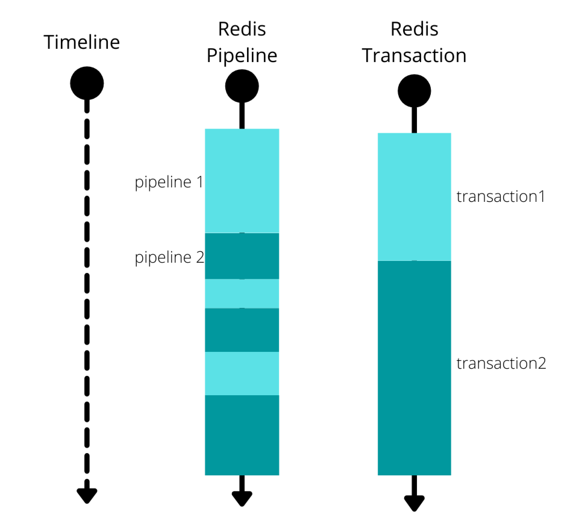

# Redis性能优化

## 使用批量操作减少网络传输

一个Redis命令可以简化为四步：

1. 发送命令；
2. 命令排队；
3. 命令执行；
4. 返回结果。

第一步和第四步时间之和称为Round Trip Time（RTT，往返时间），也就是数据在网络上传输的时间。使用批量操作可以减少网络传输次数，进而有效减小网络开销，大幅减少RTT。

### 原生批量操作命令

Redis中有一些原生支持批量操作的命令：

- MGET（获取一个或多个指定key的值）、MSET（设置一个或多个指定的key）
- HMGET（获取指定哈希表中一个或多个指定字段的值）、HMSET（同时将一个或多个filed-value对设置到指定哈希表中）。
- SADD（向指定集合添加一个或多个元素）
- ……

不过在Redis官方提供的分片集群解决方案Redis cluster下，使用原生批量操作命令可能会存在问题。比如说MGET无法保证所有key都在同一个hash slot（哈希槽）上，MGET还是需要多次网络传输，原子操作也无法保证了。相较于非批量操作，还是可以减少网络传输次数。

整个步骤如下：

1. 找到key对应的所有哈希槽；
2. 分别向对应的Redis节点发起MGET请求数据；
3. 等待所有请求执行结束，重新组装结果数据，保持跟入参key的顺序一致，然后返回结果。

### pipeline

对于不支持批量操作的命令，我们可以利用pipeline（流水线）将一批redis命令封装成一组，这些Redis命令会被一次性提交到Redis服务器，只需要一次网络传输。不过需要控制一次批量操作的元素个数（例如500以内，实际也和元素字节数有关），避免网络传输的数据量过大。

与批量操作命令类似，pipeline在redis cluster上操作会有一些小问题。原因类似，无法保证所有key都在同一个hash slot（哈希槽）上。如果想要使用，客户端需要自己维护key和哈希槽的关系。

原生批量命令和pipeline是有区别的：

- 原生批量操作命令是原子操作，pipeline是非原子操作；
- pipeline可以打包不同的命令，原生批量操作不可以；
- 原生批量操作命令是Redis服务端支持实现的，而pipeline需要服务端和客户端共同实现。

pipeline和事务的对比：

- 事务是原子操作，pipeline是非原子操作。两个不同的事务不会同时运行，而pipeline可以同时以交错方式执行。
- Redis事务中每个命令都需要发送到服务端，而pipeline只需要发送一次，网络传输次数更少。

pipeline不适用于执行顺序有依赖关系的一批命令。比如说要将前一个命令的结果给后续的命令使用。对于这种需求可以使用lua脚本。

### Lua脚本

Lua脚本同样支持批量操作多条命令。一段Lua脚本可以看作是一条命令执行，可以看作是原子操作。一段Lua脚本执行过程中不会有其他脚本或Redis命令执行，保证了操作不会被其他命令插入或打扰，这是pipeline不支持的。并且，Lua脚本支持一些简单的逻辑处理，比如使用命令读取值并在lua脚本中进行处理，同样是pipeline无法具备的。

Lua脚本依然存在缺陷：

- 如果Lua脚本运行过程中出错，之后的操作不会运行，但是之前已经发生的写操作无法撤回，所以即使使用了Lua脚本也无法实现类似数据库回滚的原子性。
- Redis cluster下，Lua脚本的原子操作也无法保证，原因同样是无法保证所有key都在同一个hash slot（哈希槽）上。

## 大量Key集中过期问题

对于过期key，Redis采用的是定期删除+惰性/懒汉式删除策略。定期删除执行过程中，如果突然遇到大量过期key的话，客户端请求必须等待定期清理过期key任务线程执行完成，因为定期任务线程是在Redis主线程中执行的。导致客户端的请求无法及时处理，响应速度会比较慢。

如何解决？

- 给key设置随机过期时间。
- 开启lazy-free（惰性删除/延迟释放）。lazy-free特性是Redis4.0开始引入的，指的是让Redis采用异步延迟释放key使用的内存，将操作交给单独的子线程处理，避免阻塞主线程。

## Redis bigkey（大key）

如果一个key对应的value所占用的内存比较大，那么key可以看作是bigkey。具体多大，没有精确标准：

- String类型的value超过1MB。
- 复合类型（List、Hash、Set、Sorted Set等）的value包含的元素超过5000个。

### bigkey是怎么产生的？

- 程序设计不当，比如直接使用String类型存储较大的文件对应的二进制数据。
- 对于业务的数据规模考虑不周到，比如使用集合类型没有考虑到数据量的快速增长。
- 未及时清理垃圾数据，比如哈希中冗余了大量的无用的键值对。

### 如何发现bigkey？

1. 使用Redis自带的 --bigkeys参数来查找

    redis-cli -p 6379 --bigkeys

    这个命令会扫描（Scan）Redis中的所有key，会对Redis的性能有一点影响。这种方式只能找出每种数据结构 top 1 bigkey（占用内存最大的String数据类型，包含元素最多的复合数据类型）。然而一个key包含的元素多并不代表占用内存也多，需要根据业务具体情况进一步判断。

    在线上执行该命令时，为了降低对Redis的影响，需要指定-i参数控制扫描的频率。redis-cli -p 6379 --bigkeys -i 3 表示扫描过程中每次扫描后休息的时间间隔是3秒。
2. 使用Redis自带的SCAN命令
    SCAN命令可以按照一定的模式和数量返回匹配的key。获取了key之后，可以利用STRLEN、HLEN、LLEN等命令返回其长度或成员数量。

3. 借助开源工具分析RDB文件
    通过分析RDB文件来找出bigkey。这种方案的前提是Redis采用的是RDB持久化。

4. 借助公有云的Redis分析服务

### 如何处理bigkey？

- 分割bigkey：将一个bigkey分割为多个小key。
- 手动清理：Redis4.0+ 可以使用 UNLINK 命令来异步删除一个或多个指定的key。
- 采用合适的数据结构：例如，文件二进制数据不使用String保存、使用HyperLogLog统计页面UV、Bitmap保存状态信息（0/1）。
- 开启lazy-free（惰性删除/延迟释放）：lazy-free特性是Redis4.0开始引入的，指的是让Redis采用异步方式延迟释放key使用的内存，将该操作交给单独的子线程处理，避免阻塞主线程。

## Redis hotkey（热key）

如果一个key的访问次数比较多明显多于其他key的话，那这个key可以看作是hotkey（热key）。

hotkey出现的原因主要是某个热点数据访问量暴增，如重大的热搜事件、参与秒杀的商品。

### 如何发现hotkey？

1. 使用redis自带的 --hotkeys参数来查找。

    Redis4.0版本中新增了hotkeys参数，该参数能够返回所有key的被访问次数。使用刚方案的前提是Redis Server的maxmemory-policy参数设置为LFU算法，不然会出现错误。

   Redis中有LFU算法：
   - volatile-lfu（least frequently used）：从已设置过期时间的数据集（server.db[i].expires）中挑选最不经常使用的数据淘汰。
   - allkeys-lfu（least frequently used）：当内存不足以容纳新写入数据时，在键空间中，移除最不常使用的key。

2. 使用MONITOR命令

    MONITOR命令是Redis提供的一种实时查看Redis的所有操作的方式，可以用于临时监控Redis实例的操作情况，包括读写、删除等操作。由于该命令对Redis影响较大，因此禁止长时间开启MONITOR（生产环境谨慎使用）。

3. 借助开源项目

    京东零售hotkey。

4. 根据业务情况提前预估。
5. 业务代码中记录分析。
6. 借助公有云Redis分析服务。

### 如何解决hotkey？

- 读写分离：主节点处理写请求，从节点处理读请求。
- 使用Redis cluster：将热点数据分散存储在多个Redis节点上。
- 二级缓存：hotkey采用二级缓存的方式进行处理，将hotkey存放到JVM本地内存中（可以用caffeine）。

## 慢查询命令

Redis提供了一个慢查询日志（Slow log）功能，专门用来记录执行时间超过阈值的命令，原理和MySQL的慢查询日志类似。

在redis.conf文件中，可以slowlog-log-slower-than参数设置耗时命令的阈值，并使用slowlog-max-len参数设置耗时命令的最大记录条数。

当Redis检测到执行时间超过阈值slowlog-log-slower-than的命令时，就会将命令记录到慢查询日志中。当慢查询日志的记录条数超过slowlow-max-len时，Redis会丢弃最早执行命令依次丢弃。

慢查询日志的记录由以下几个部分构成：

1. 唯一ID：日志条目的唯一ID。
2. 时间戳（Timestamp）：命令执行完成时的Unix时间戳。
3. 耗时（Duration）：命令执行所完成的时间，单位是微秒。
4. 命令及参数（Command）：执行的具体命令和参数数组。
5. 客户端信息（Client IP:Port）：执行命令的客户端地址和端口。
6. 客户端名称（Client Name）：如果客户端设置了名称（CLIENT SETNAME）。

SLOWLOG GET 默认返回10条慢查询命令，可以指定返回的慢查询命令的条数。
