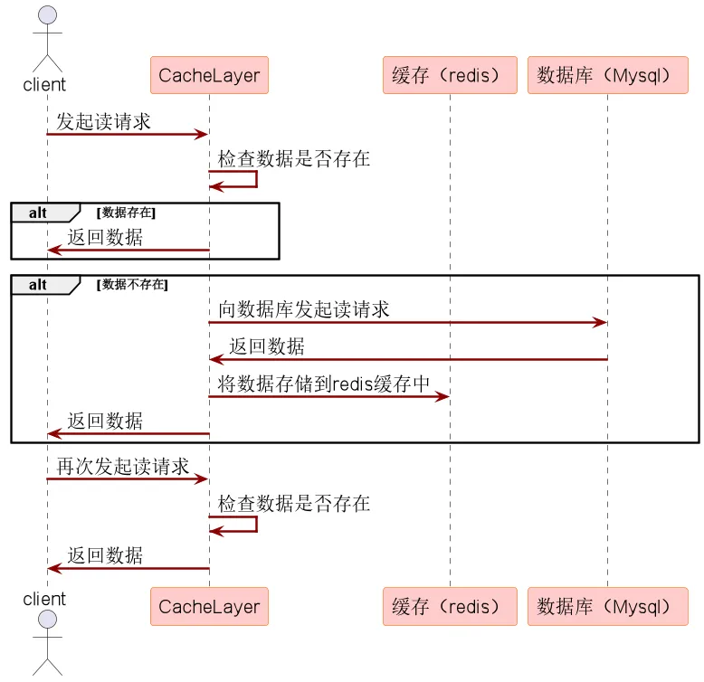
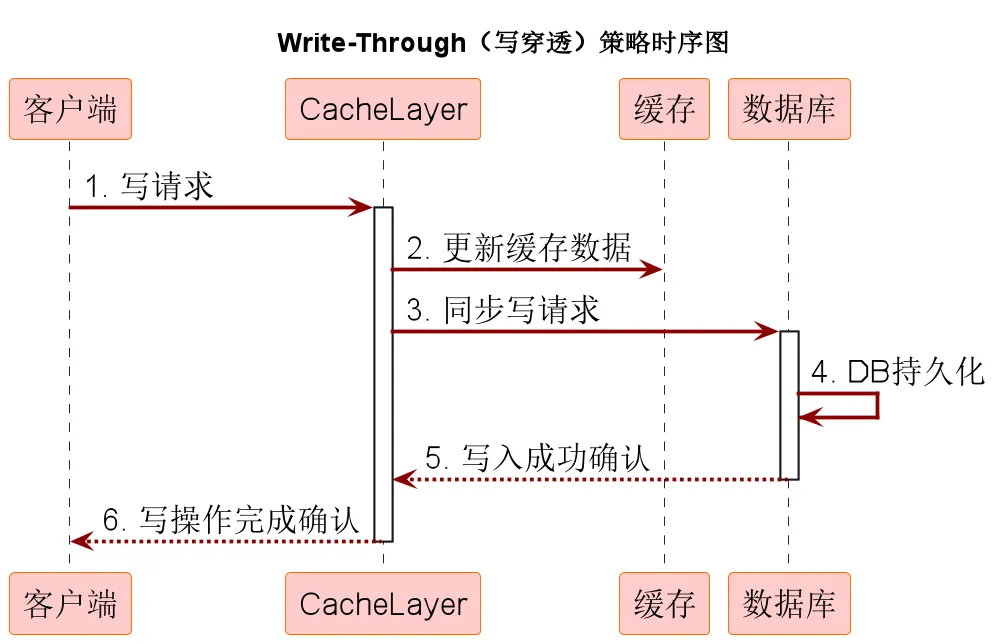
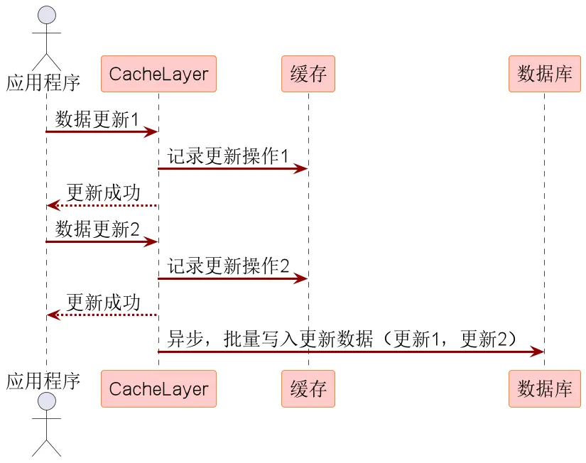
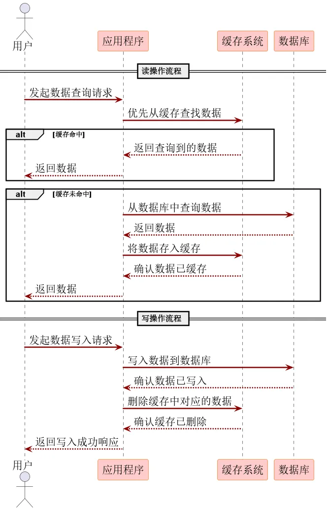

# Redis缓存一致性

## Read-Through（读穿透）

Read-Through 是一种在缓存中找不到数据时，自动从持久化存储中加载数据并回填到缓存中的策略。

## Write-Through（写穿透）

Write-Through 是一种在缓存中更新数据时，同时将更新操作同步到持久化存储的策略。

## Write behind（异步缓存写入）

也称为Write Back（回写）或异步更新策略，是一种在处理缓存与持久化存储（如数据库）之间数据同步时的策略。

在这种模式下，当数据在缓存中被更新时，并非立即同步更新到数据库，而是将更新操作暂存起来，随后以异步的方式批量地将缓存中的更改写入持久化存储。

## Cache-Aside Pattern（旁路缓存模式）

又叫旁路路由策略，在这种模式中，读取缓存、读取数据库和更新缓存的操作都是在应用程序中完成。

Cache-Aside Pattern 是一种在分布式系统中广泛采用的缓存和数据库协同工作策略，在这个模式中，数据以数据库为主存储，缓存作为提升读取效率的辅助手段。

数据什么时候从数据库加载到缓存呢？

- 懒汉模式，在使用时临时加载缓存。
- 饿汉模式，提前预加载缓存。

### Cache-Aside在写入的时候，为什么是删除缓存而不是更新缓存呢？

