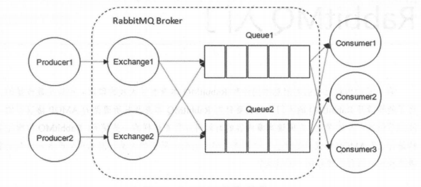
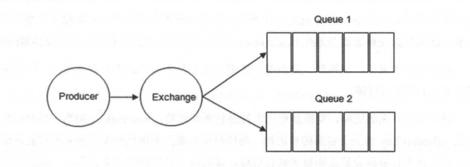

# RabbitMQ整体架构

RabbitMQ整体上是一个生产者与消费者模型，主要负责接收、存储和转发消息。

## Producer（生产者）和Consumer（消费者）

消息一般由两部分组成：消息头（或者说是标签Label）和消息体。消息体可以称为payLoad，消息体是不透明的，而消息头则由一系列的可选属性组成，这些属性包括routing-key（路由键）、priority（相对于其他消息的优先权）、delivery-mode（指出该消息可能需要持久性存储）。生产者把消息交由RabbitMQ后，RabbitMQ会根据消息头把消息发送给感兴趣的Consumer（消费者）。

## Exchange（交换器）

Exchange用来接收生产者发送的消息，并将这些消息路由给服务器中的Queue（队列）中，如果路由不到，或许会返回给Producer（生产者），或许会被直接丢弃掉。

Exchange有四种类型，不同的类型对应不同的路由策略：direct（默认）、fanout、topic和headers。

生产者讲消息发送给交换器的时候，一般会指定一个RoutingKey（路由键），用来指定这个消息的路由规则，而这个RoutingKey需要与交换器类型和绑定键（BindingKey）联合使用才能最终生效。

RabbitMQ中通过Binding（绑定）将Exchange（交换器）与Queue（消息队列）关联起来，在绑定的时候一般会指定一个BindingKey（绑定键），RabbitMQ就知道如何正确将消息路由到队列了。

### ExchangeType（交换器类型）

1. fanout

    fanout类型的Exchange路由规则简单，会把所有发送到该Exchange的消息发送到所有与它绑定的Queue中。常用来广播消息。

2. direct

    会把消息路由到那些BindingKey与RoutingKey完全匹配的Queue中。常用在处理有优先级的任务，根据任务的优先级把消息发送到对应的队列，可以指派更多的资源去处理高优先级的队列。

    

3. topic

    会将消息路由到BindingKey和RoutingKey相匹配的队列中，匹配规则有些不同。
    - RoutingKey为一个点号”.“分隔的字符串（被点号分隔开的每一段独立的字符串称为一个单词）。
    - BindingKey中可以存在两种特殊字符串“\*”和“#”，用于做模糊匹配，其中“\*”用于匹配一个单词，“#”用于匹配多个单词（可以是零个）。

4. headers

## Queue（消息队列）

Queue（消息队列）用来保存消息直到发送给消费者。它是消息的容器，也是消息终点。一个消息可投入一个或多个队列。消息一直在队列里面，等待消费者连接到这个队列将其取走。

多个消费者可以订阅同一个队列，这时队列中的消息会被平均分摊（Round-Robin，轮询）给多个消费者进行处理，而不是每个消费者都能收到所有的消息并处理，避免消息被重复消费。

## Broker（消息中间件的服务节点）

对于RabbitMQ来说，一个RabbitMQ Broker可以简单地看作一个RabbitMQ服务节点，或者RabbitMQ服务实例。大多数也可以将一个RabbitMQ Broker看作一台RabbitMQ服务器。

