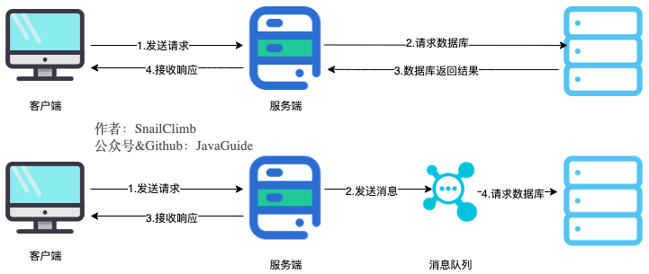
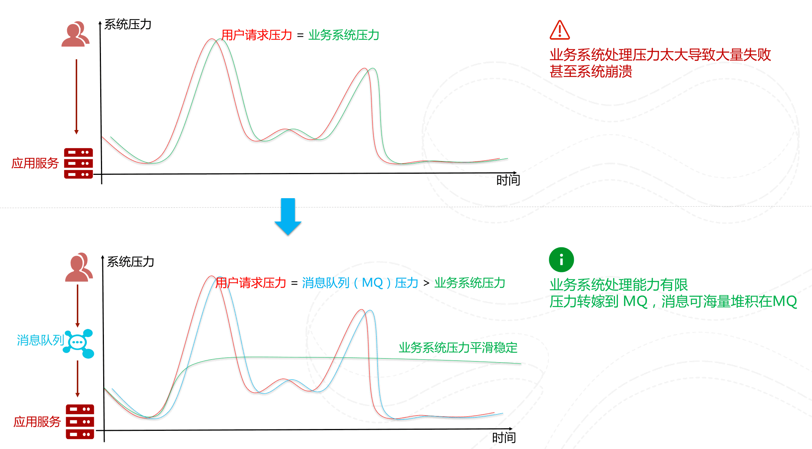

# 消息队列

## 消息队列作用

### 异步处理

将用户请求中包含的耗时操作，通过消息队列实现异步处理，将对应的消息发送到消息队列后就返回结果，减少响应时间，提高用户体验。

### 削峰/限流

先将短时间高并发产生的事务消息存储在消息队列，然后后端服务再慢慢根据自己的能力去消费这些消息，避免直接把后端服务打垮。

### 降低系统耦合性

消息队列使用发布-订阅模式工作，消息发送者（生产者）发布消息，一个或多个消息接收者（消费者）定语消息。

### 顺序保证

### 延时/定时处理

消息发送后不会立即被消费，而是指定一个时间，到时间后再消费。

### 即时通讯

MQTT（消息队列遥测传输协议）是一种轻量级的通讯协议，采用发布/订阅模式，非常适合于物联网（IoT）等需要在低带宽、高延迟或不可靠网络环境下工作的应用。支持即时消息传递，即使在网络条件较差的情况下也能保持通信的稳定性。

### 数据流处理
