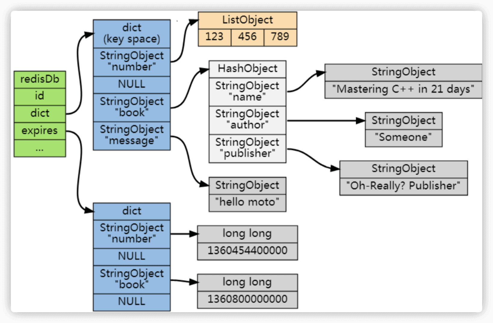

# Redis内存管理

## Redis是如何判断数据是否过期

Redis通过一个叫做过期字典（可以看作是hash表）来保存数据过期的时间。过期字典的键指向Redis数据库中的某个key（键），过期字典的值是一个longlong类型的整数，这个整数保存了key所指向的数据库键的过期时间（毫秒精度的UNIX时间戳）。

## Redi过期key删除策略

1. **惰性删除**：之后在取出/查询key的时候才对数据进行检查。这种方式对CPU最友好，但是可能会造成太多过期key没有被删除。
2. **定期删除**：周期性地随机从设置了过期时间的key中抽查一批，然后逐个检查这些key是否过期，过期就删除key。相比于惰性删除，定期删除对内存更友好，对CPU不太友好。
3. **延迟队列**：把设置过期时间的key放到一个延迟队列里，到期之后就删除key。这种方式可以保证每个key都能被删除，但维护延迟队列太麻烦，队列本身也要占用资源。
4. **定时删除**：每个设置了过期时间的key都会在设置的时间到达时立即被删除。这种方法可以确保内存中不会有过期的键，但是对CPU的压力最大，因为需要为每个键都设置一个定时器。

### Redis采用的是哪种删除策略

Redis采用的是定期删除+惰性/懒汉式删除结合的策略，也是大部分缓存框架的选择。定期删除对内存更加友好，惰性删除对CPU更加友好。

Redis的定期删除过程是随机的（周期性地随机从设置了过期时间key中抽查一批），所以并不保证所有过期键都会被立即删除。Redis底层通过限制删除操作执行的时长和频率来减少删除操作对CPU时间的影响。

### 为什么定期删除不是把所有过期key都删除

对性能造成影响太大。如果我们key数量非常庞大的话，挨个遍历检查是非常耗时的，会严重影响性能。

### 大量key集中过期怎么办

当Redis中存在大量key在同一时间点集中过期时，会导致以下问题：

- 请求延迟增加：Redis在处理过期key时需要消耗CPU资源，如果过期key数量庞大，会导致Redis实例的CPU占用率升高，进而影响其他请求的处理速度，增加延迟。
- 内存占用过高：过期key虽然已经失效，但在Redis真正删除之前，仍然会占用内存空间。如果过期key没有及时清理，会导致内存占用过高，甚至引发内存溢出。

采用以下方案可以避免这个问题：

- 尽量避免key集中过期：在设置键的过期时尽量随机一点。
- 开启lazy free机制：修改redis.conf配置文件，将lazyfree-lazy-expire参数设置为yes，即可开启lazy free机制。开启lazy free机制后，Redis会在后台异步删除过期的key，不会阻塞主线程的运行，从而降低对Redis性能的影响。

## 内存淘汰策略

Redis的内存淘汰策略只有在运行内存达到了配置的最大内存阈值时才会触发，这个阈值是通过redis.conf的maxmemory参数来定义的。64位操作系统下，maxmemory默认为0，表示不限制内存大小。

1. volatile-lru（least recently used）：从已设置过期时间的数据集中挑选最近最少使用的数据淘汰。
2. volatile-ttl：从已设置过期时间的数据集中挑选将要过期的数据淘汰。
3. volatile-random：从已设置过期时间的数据集中任意选择数据淘汰。
4. allkeys-lru（least recently used）：从数据集中移除最近最少使用的数据淘汰。
5. allkeys-random：从数据集中任意选择数据淘汰。
6. no-eviction（默认内存淘汰策略）：禁止驱逐数据，当内存不足以容纳新写入数据时，新写入操作会报错。
7. volatile-lfu（least frequently used）：从已设置过期时间的数据集中挑选最不经常使用的数据淘汰。
8. allkeys-lfu（least frequently used）：从数据集中移除最不经常使用的数据淘汰。
