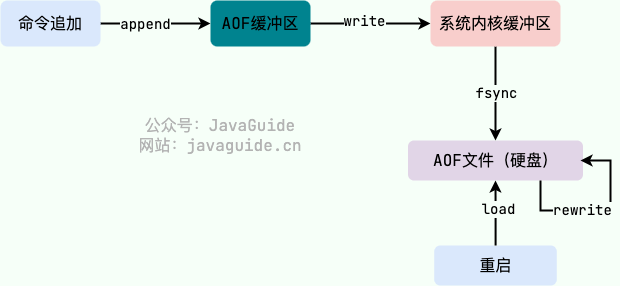

# Redis持久化机制

## RDB持久化

Redis可以通过创建快照来获得存储在内存里面的数据在某个时间点上的副本。Redis创建快照后，可以对快照进行备份，可以将快照复制到其他服务器从而创建具有相同数据的服务器副本（Redis主从结构，主要用来提高Redis性能），还可以将快照留在原地以便重启服务器使用。

### RDB持久化配置

Redis默认采用的是快照持久化方式，在redis.conf配置文件中默认有下面的配置：

- save 900 1    # 在900秒（15分钟）后，如果至少有1个key发生变化，Redis就会自动触发bgsave命令创建快照。
- save 300 10   # 在300秒（5分钟）后，如果至少有10个key发生变化，Redis就会自动触发bgsave命令创建快照。
- save 60 10000 # 在60秒（1分钟）后，如果至少有10000个key发生变化，Redis就会自动触发bgsave命令创建快照。

### RDB创建快照时会阻塞主线程嘛

Redis提供了两个命令来生成RDB快照文件：

- save：同步保存操作，会阻塞Redis主线程；
- bgsave：fork出一个子进程，子进程执行，不会阻塞Redis主线程，默认选项。

## AOF持久化

与快照持久化相比，AOF持久化的事实性更好。默认情况下Redis没有开启AOF（append only file）方式的持久化（Redis 6.0之后默认开启），可以通过appendonly参数开启。

开启AOF持久化后每执行一条会更改Redis中的数据的命令，Redis就会将该命令写入到AOF缓冲区server.aof中，然后再写入到AOF文件中（此时还在系统内核缓存区未同步到磁盘），最后再根据持久化方式（fsync策略）的配置来决定何时将系统内核缓存区的数据同步到硬盘中的。

AOF文件的保存位置和RDB文件的位置相同，都是通过dir参数设置的，默认文件名是appendonly.aof。

### 工作流程

1. 命令追加（append）：所有的写命令会追加到AOF缓冲区中。
2. 文件写入（write）：将AOF缓冲区的数据写入到AOF文件中。需要调用write函数，write将数据写入到系统内核缓冲区后直接返回了（延迟写）。
3. 文件同步（fsync）：AOF缓冲区根据对应的持久化方式（fsync策略）向硬盘做同步操作。需要调用fsync函数，fsync针对单个文件强制硬盘同步，fsync将阻塞直到写入磁盘完成后返回，保证了数据持久化。
4. 文件重写（rewrite）：随着AOF文件越来越大，需要定期对AOF文件进行重写，达到压缩的目的。
5. 重启加载（load）：当Redis重启时，可以加载AOF文件进行数据恢复。

AOF持久化流程图如下：

### AOF持久化方式有哪些

1. appendfsync always：主线程调用write写操作后，后台线程（aof_fsync线程）立即会调用fsync函数同步AOF文件（刷盘），fsync完成后线程返回，这样会严重降低Redis的性能（write+fysnc）。
2. appendfsync everysec：主线程调用write执行写操作后立即返回，由后台线程（aof_fsync线程）每秒钟调用fsync函数（系统调用）同步一次AOF文件（write+fsync，fsync间隔为1秒）。
3. appendfsync no：主线程调用write执行写操作后立即返回，让操作系统决定何时进行同步，Linux下一般为30秒一次（write但不fsync，fsync的时机🈶操作系统决定）。

为了兼顾数据和性能，可以考虑使用appendfsync everysec，让Redis每秒同步一次AOF文件，Redis性能受到的影响较小。即使出现系统崩溃，最多丢失1秒之内的数据。

### AOF为什么执行完命令之后记录日志

- 避免额外的检查开销，AOF记录日志不会对命令进行语法检查；
- 在命令执行完之后再记录，不会阻塞当前的命令执行。

### AOF重写

当AOF变得太大时，Redis能够在后台自动重写AOF产生一个新的AOF文件，这个新的AOF文件和原有的AOF文件所报错的数据库状态一样，但体积更小。

AOF重写是通过读取数据库中的键值对来实现的，程序无须对现有AOF文件进行任何读入、分析或者写入操作。

AOF文件重写期间，Redis还会维护一个AOF重写缓冲区，该缓冲区会在子进程创建AOF文件期间，记录服务器执行的所有写命令。当子进程完成创建新AOF文件的工作之后，服务器会将重写缓冲区中的所有内容追加到新AOF文件的末尾，使得新的AOF文件保存的数据库状态与现有的数据库状态一致。最后，服务器用新的AOF文件替换旧的AOF文件，以此完成AOF文件重写操作。

开启AOF重写功能，可以调用BGREWRITE命令手动执行，也可以设置下面两个配置项，让程序自动决定触发时机：

- auto-rewrite-min-size：如果AOF文件大小小于该值，则不会触发AOF重写。默认值为64MB。
- auto-rewrite-percentage：执行AOF重写时，当前AOF大小（aof_current_size）和上一次重写时AOF大小（aof_base_size）的比值。如果当前AOF文件大小增加了这个百分比值，将触发AOF重写。将此值设置为0将禁用自动AOF重写。默认值为100。

### AOF校验机制

在纯AOF模式下，Redis不会对整个AOF文件使用校验和（如CRC64），而是通过逐条解析文件中的命令来验证文件的有效性。如果解析过程中发现语法错误（如命令不完整、格式错误），Redis会终止加载并报错，从而避免错误数据载入内存。

在混合持久化模式下，AOF文件由两部分组成：

- RDB快照部分：文件以固定的REDIS字符开头，存储某一时刻的内存数据快照，并在快照数据末尾附带一个CRC64校验和（位于RDB数据块尾部、AOF增量部分之前）。
- AOF增量部分：紧随RDB快照部分之后，记录RDB快照生成后的增量写命令。这部分增量写命令以Redis协议格式逐条记录，无整体或全局校验和。

## 如何选择RDB和AOF

### RDB比AOF优秀的地方

- RDB文件存储的内容是经过压缩的二进制数据，保存着某个时间点的数据集，文件很小，适合做数据备份，灾难恢复。AOF文件存储的是每一次写命令，类似于MySQL的binlog日志，通常会比RDB文件大很多。
- 使用RDB文件恢复数据，直接解析还原数据即可，不需要一条一条地执行命令，速度非常快。而AOF则需要以此执行每个写命令，速度非常慢。

### AOF比RDB优秀的地方

- RDB的数据安全性不如AOF，没有办法实时或秒级持久化数据。生成RDB文件的过程是比较繁重的，虽然BGSAVE子进程写入RDB文件的工作不会阻塞主线程，但会对机器的CPU资源和内存资源产生影响。AOF支持秒级数据丢失（取决于fsync策略），仅仅是追加命令到AOF文件，操作轻量。
- RDB文件是以特定的二进制格式保存的，并且在Redis版本演进中有多个版本的RDB，所以存在老版本的Redis服务不兼容新版本的RDB格式的问题。
- AOF以一种易于理解和解析的格式包含所有操作的日志。可以轻松导出AOF文件进行分析，可以直接操作AOF文件来解决一些问题。

## 混合持久化

Redis 4.0 开始支持RDB和AOF的混合持久化（默认关闭，可以通过配置项aof-use-rdb-preamble开启）。

如果把混合持久化打开，AOF重写的时候就直接把RDB的内容写到AOF开头。这样做的好处是结合RDB和AOF的优点，快速加载同时避免丢失过多的数据。缺点是AOF里面的RDB部分是压缩格式不再是AOF格式，可读性较差。
