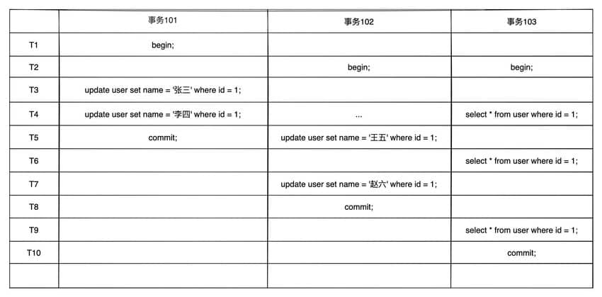
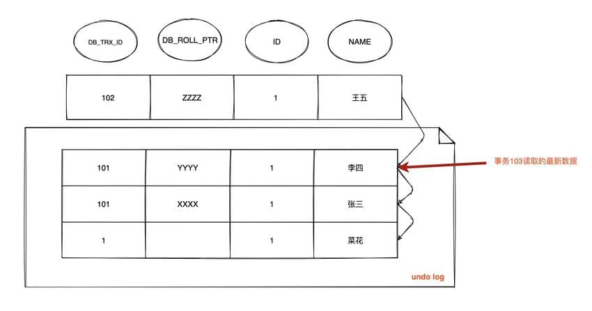
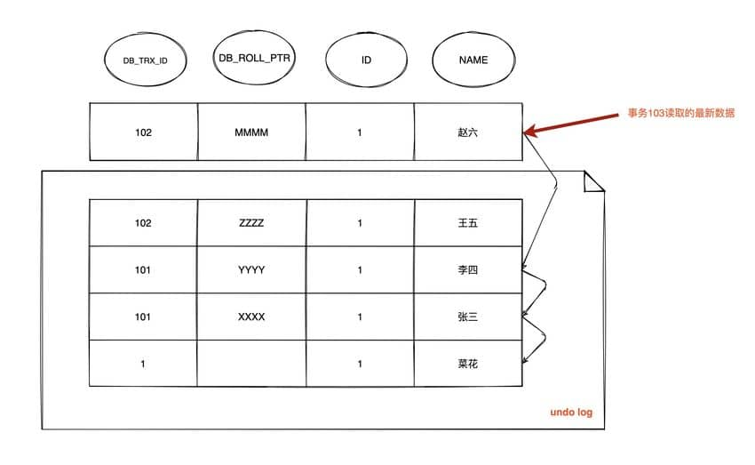

# InnoDB存储引擎的MVCC实现机制

## MVCC的产生背景

MVCC是为了实现读-写冲突不加锁，读指的是快照读而不是当前读，当前读是一种加锁的操作，是悲观锁的实现。

- 读-读：不存在任何问题，也不需要并发控制。
- 读-写：有线程安全问题，可能会造成事务隔离性问题，可能遇到脏读，幻读，不可重复度。
- 写-写：有线程安全问题，可能会存在更新丢失问题，比如第一类更新丢失（回滚丢失），第二类更新丢失（覆盖丢失）。
  - 回滚丢失：A事务撤销时，把已经提交的B事务的更新数据覆盖了。
  - 覆盖丢失：A事务覆盖B事务已经提交的数据，造成B事务所做操作丢失。

## 什么是MVCC

多版本并发控制，是一种并发控制的方法，一般在数据库管理系统中，实现对数据库的并发访问，在编程语言中实现事务内存。MVCC在InnoDB中的实现主要是为了提高数据库并发性能，用更好的方式去处理读-写冲突，做到即使有读写冲突时，也能做到不加锁，非阻塞并发读。MVCC只在RC和RR两个隔离级别下工作，其他两个隔离级别和MVCC不兼容，因为RU总是读取最新的数据行，而不是符合当前事务版本的数据行，而SERIALIZABLE则会对所有读取的行都加锁。

## 当前读和快照读

### 当前读

当前读就是像select lock in share mode(共享锁)，select * from db for update；update，insert，delete（排他锁），读取的是记录的最新版本，读取时还要保证其他并发事务不能修改当前记录，会对读取的记录进行加锁。

### 快照读

快照读就是像不加锁的select操作就是快照读，即不加锁的非阻塞读，快照读的前提是隔离级别不是串行级别，串行级别下的快照读会退化成当前读；快照读的实现是基于多版本并发控制，即MVCC，可以认为MVCC是行锁的一个变种，在很多情况下，避免了加锁操作，降低了开销；既然是基于多版本，那可能读到的不一定是最新的版本，有可能是之前的历史版本。

## MVCC的实现原理

主要是依赖记录中的3个隐式字段，undo log，Read View来实现的。

### 隐式字段

1. DB_ROW_ID 6byte，隐含的自增ID（隐藏主键），如果数据表没有主键且没有唯一非空索引时，InnoDB会自动以DB_ROW_ID产生一个聚簇索引。
2. DB_TRX_ID 6byte，最近修改（修改/插入）事务ID：记录创建这条记录/最后一次修改该记录的事务ID。
3. DB_ROLL_PTR 7byte，回滚指针，指向这条记录的上一个版本（存储于rollback segment里）。配合undo日志，指向上一个版本。如果该行没有更新，则为空。
4. DELETE_BIT 1byte，记录被更新或删除并不代表真的删除，而是删除flag变了。

### undo log

主要有两个作用：

1. 当事务回滚时将数据恢复到修改前的样子。
2. MVCC，当读取记录时，若该记录被其他事务占用或该记录当前版本对当前事务不可见时，则可以通过undolog读取之前的数据版本，以此实现非锁定读。

主要用于记录数据被修改之前的日志，在表信息修改之前会先把数据拷贝到undo log里，当事务进行回滚时可以通过undo log里的日志进行还原。InnoDB把这些为了回滚而记录的这些东西称之为undo log。这里需要注意的一点是，由于查询操作（SELECT）并不会修改任何用户记录，所以在查询操作时，不会记录用户相应的日志。undo log主要记录的是数据的逻辑变化，它是逻辑日志。可以认为当delete一条记录时，undo log中会记录一条对应的insert记录，反之亦然，当update一条记录时，它记录一条对应相反的update记录。当执行rollback时，就可以从undo log中的逻辑记录读取到相应的内容并进行回滚。

- Insert undo log：插入一条记录时，至少要把这条记录的主键值记下来，之后回滚的时候只需要把这个主键对应的记录删掉就好。
- Update undo log：修改一条记录时，至少要把修改这条记录前的旧值都记录下来，这样之后回滚时再把这条记录更新为旧值就好了。
- Delete undo log：删除一条记录时，至少要把这条记录中的内容都记下来，之后回滚时再把由这些内容组成的记录插入到表中。

删除操作都只是设置一下老记录的DELETE_BIT，并不真正将过时的记录删除。InnoDB有专门的purge线程来清理DELETED_BIT为true的记录。为了不影响MVCC的正常工作，purge线程自己维护了一个read view（这个read view相当于系统中最老活跃事务的read view）；如果某个记录的DELETED_BIT为true，并且DB_TRX_ID相对于purge线程的read view可见，那么这条记录一定是可以被安全清除的。

不同事务或者相同事务的对同一记录的修改，会导致该记录的undo log成为一条记录版本线性表，即链表，undo log的首链就是最新的旧记录，链尾就是最早的旧记录。

### Read View（读视图）

Read View 主要用来做可见性判断，保存了当前对本事务不可见的其他活跃事务。主要包含以下字段：

- m_low_limit_id：目前出现过的最大事务ID+1，即下一个即将被分配的事务ID。大于等于这个ID的数据版本均不可见。
- m_up_limit_id：活跃事务列表m_ids中最小的事务id，如果m_ids为空，则m_up_limit_id为m_low_limit_id。小于这个id的数据版本均不可见。
- m_ids：ReadView创建时，其他未提交的活跃事务ID列表。创建ReadView时，将当前未提交的活跃事务ID记录下来，后续即使他们修改了改行的数据，对于当前事务也是不可见的。m_ids不包括当前事务自己和已提交的事务。
- m_creator_trx_id：创建该ReadView的事务ID。

主要就是有个列表来存储我们系统中当前活跃着的读写事务，也就是begin了还未提交的事务。通过这个列表来判断记录的某个版本是否对当前事务可见。这个ReadView中有个 id 列表 m_ids 来存储系统中当前活跃着的读写事务，也就是 begin 了还未 commit 或 rollback 的事务。RC每次查询数据前都生成一个ReadView。RR在第一次查询数据时生成一个ReadView，之后的读都复用之前的。readview主要是用来做可见性判断的，即当我们某个事务执行快照读的时候，对该记录创建一个readview读视图，把它比作条件用来判断当前事务能够看到哪个版本的数据，既可能是当前最新的数据，也可能是该行记录的undo log里面的某个版本的数据。readview遵循一个可见性算法，主要是将要被修改的数据的最新记录中的DB_TRX_ID（即当前事务ID）取出来，与系统当前其他活跃事务的ID去对比（由read view维护），如果DB_TRX_ID跟readview的属性做了某些比较，不符合可见性，那就通过DB_ROLL_PTR回滚指针去取出undo log中的DB_TRX_ID再比较，即遍历链表的DB_TRX_ID，直到找到满足特定条件的DB_TRX_ID，这个所在的旧记录就是当前事务能看见的最新老版本。

### 数据可见性算法

在InnoDB存储引擎中，每个select语句执行前都会创建一个快照ReadView，快照中保存了当前活跃（没有commit）的事务ID。就是保存的是系统中当前不应该被本事务看到的其他事务ID列表（即m_ids）。当用户在这个事务中要读取某个记录行时，InnoDB会将该记录行DB_TRX_ID与ReadView中的一些变量以及当前事务ID进行比较，判断是否满足可见性。

1. 如果DB_TRX_ID < m_up_limit_id，说明最新修改行的事务（DB_TRX_ID）在当前事务创建ReadView前就已经提交了，所以该记录行的值对当前事务是可见的。
2. 如果DB_TRX_ID >= m_low_limit_id，那么表明最新修改该行的事务（DB_TRX_ID）在当前事务创建ReadView之后才修改该行，所以该记录行的值对当前事务不可见。
3. m_ids为空，则表明在当前事务创建ReadView之前，修改该行的事务已经提交，所以该记录行的值对当前事务是可见的。
4. 如果m_up_limit_id <= DB_TRX_ID < m_low_limit_id，说明最新修改该行的事务ID（DB_TRX_ID）在当前事务创建快照时可能处于活跃或已提交状态。所以要对活跃事务列表m_ids进行查找（源码中用二分查找，因为是有序的）。
   - 如果在m_ids中能找到DB_TRX_ID，表明在当前事务创建快照前，该记录行的值被事务ID为DB_TRX_ID的事务修改了，但没有提交；或者在当前事务创建快照后，该记录行的值被事务ID为DB_TRX_ID的事务修改了。这些情况下，这个记录行的值对当前事务是不可见的。跳转到步骤5。
   - 如果在m_ids中找不到DB_TRX_ID，说明在当前事务创建快照前，该记录行的值被事务ID为DB_TRX_ID的事务修改了，且该事务已经提交，所以记录行对当前事务是可见的。
5. 在该记录行的DB_ROLL_PTR指针所指向的undo log取出快照记录，用快照记录的DB_TRX_ID跳到步骤1重新进行判断，直到找到满足的快照版本或返回空。

## RC和RR隔离级别下MVCC的差异

1. 在RC隔离级别下，每一次select查询前都会生成一个ReadView（m_ids列表）。
2. 在RR隔离级别下，只会在事务开始后第一次select查询数据前生成一个ReadView（m_ids列表）。

## MVCC解决不可重复读问题

RC和RR都会生成ReadView，但由于生成时机不同，从而在RR级别下解决不可重复读问题。

### 在RC下ReadView生成情况

1. 假设时间线在T4，此时数据行id=1的版本链为

    

    由于在RC隔离级别下，每次查询前都会生成ReadView，并且当前活跃的事务ID列表为[101,102]，当前事务ID为103，m_low_limit_id为104，m_up_limit_id为101，m_creator_trx_id为103。

    - 此时最新纪录DB_TRX_ID为101，m_up_limit_id <= DB_TRX_ID < m_low_limit_id，所以要在活跃事务列表m_ids中查询，查询到m_ids列表中有101，那么最新数据对当前事务不可见。
    - 根据DB_ROLL_PTR找到undolog中的上一个版本记录，上一条记录的DB_TRX_ID还是101，那么该记录对当前事务还是不可见。
    - 继续找上一条DB_TRX_ID为1，1 < m_up_limit_id，那么这条记录对当前事务可见。
    - 查询到的数据为name=菜花。

2. 假设时间线在T6，此时数据行的版本链为

    

    在RC隔离级别下，再次查询还会生成一个ReadView，当前活跃的事务ID列表为[102]，当前事务Id为103，m_up_limit_id为102，m_low_limit_id为104，m_creator_trx_id为103。

    - 此时最新纪录DB_TRX_ID为102，m_up_limit_id <= DB_TRX_ID < m_low_limit_id，所以要在活跃事务列表m_ids中查询，查询到m_ids列表中有102，那么最新数据对当前事务不可见。
    - 根据DB_ROLL_PTR找到undolog中的上一个版本纪录，上一条的记录的DB_TRX_ID为101，满足101 < m_up_limit_id，记录可见。
    - 在T6时间查询到的数据为李四，与T4时间查询到的数据不一致，不可重复读！

3. 假设时间线在T9，事务A要去读id=1的数据，此时数据行的版本链为

    

    在RC隔离级别下，再次查询还会生成一个ReadView，当前没有活跃事务，所以m_up_limit_id = m_low_limit_id为104，m_creator_trx_id为103。

    - 此时最新纪录DB_TRX_ID为102，满足 102 < m_low_limit_id，所以在m_ids中查询，但是m_ids为空，说明该事务已经提交，那么最新数据对当前事务可见。
    - 查询到的数据为赵六，不可重复读！

### 在RR下ReadView生成情况

1. 在时间线T4下，此时数据行id=1的版本链为

    

    在RR隔离级别下，在第一次查询前会生成一个ReadView，当前活跃的事务ID列表为[101,102]，m_up_limit_id为101，m_low_limit_id为104，m_creator_trx_id为103。

    - 此时最新记录DB_TRX_ID为101，m_up_limit_id <= DB_TRX_ID < m_low_limit_id，所以要在活跃事务列表m_ids中查询，查询到m_ids列表中有101，那么最新数据对当前事务不可见。
    - 根据DB_TRX_ROLL找到undolog中的上一个版本记录，上一条记录的DB_TRX_ID为101，那么该记录对当前事务还是不可见。
    - 继续找上一条DB_TRX_ID为1，1 < m_up_limit_id，那么该条记录对当前事务可见。
    - 查询到的数据为name=菜花。

2. 在时间线T6下，此时数据行id=1的版本链为

    

    在RR隔离级别下，继续使用第一次查询前创建的ReadView，当前活跃的事务列表还是[101,102]，m_up_limit_id为101，m_low_limit_id为104，m_creator_trx_id为103。

    - 此时最新记录DB_TRX_ID为102，m_up_limit < DB_TRX_ID < m_low_limit_id，所以要在活跃事务列表m_ids中查询，查询到m_ids列表中有102，那么最新数据对当前事务不可见。
    - 根据DB_TRX_ROLL找到undolog的上一个版本记录，上一条记录的DB_TRX_ID为101，那么该记录对当前事务还是不可见。
    - 再继续查找上一条DB_TRX_ID为101，m_up_limit_id <= 101 < m_low_limit_id，需要在活跃事务列表m_ids中查询，查询到m_ids列表中有101，那么该记录对当前事务不可见。
    - 继续查找上一条DB_TRX_ID为1，1 < m_up_limit_id，那么该条记录对当前事务可见。
    - 查询到的数据为name=菜花。

3. 在时间线T8，此时数据行id=1的版本链为

    

    在RR隔离级别下，此时情况跟在T6时间线是一样的，继续使用ReadView，活跃的事务列表还是[101,102]，所以查询结果还是name=菜花。

## MVCC+Next-key-Lock防止幻读

InnoDB存储引擎在RR级别下通过MVCC+Next-key-Lock来解决幻读问题。

1. 执行普通select，此时会以MVCC快照读的方式读取数据。

    在快照读的情况下，RR隔离级别只会在事务开启后的第一次查询创建ReadView，并使用至事务提交。所以生成ReadView之后其他事务所做的更新、插入记录版本对当前事务都不可见，实现了可重复读和防止快照读下的“幻读”。

2. 执行select .. for update/lock in share mode、insert、update、delete等当前读。

    在当前读下，读取的都是最新数据，如果其他事务有插入新的数据记录，并且在当前事务查询范围内，就会产生幻读。InnoDB使用next-key-lock来防止这种情况。执行当前读时，会锁定读取记录的同时，锁定它们的间隙，防止其他事务在查询范围内插入数据。
