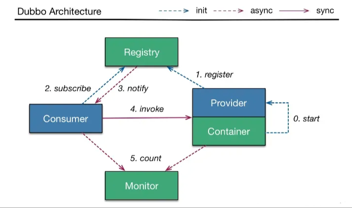
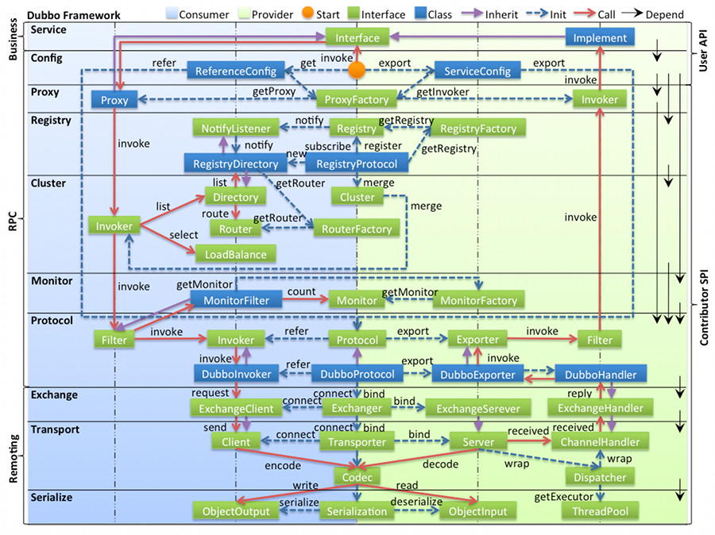

# Dubbo

Dubbo是一款高性能、轻量级的开源RPC框架，提供服务自动注册、自动发现等高效服务治理方案，可以和spring框架无缝集成。

## Dubbo使用场景

1. 透明化的远程方法调用：就像调用本地方法一样调用远程方法，只需要简单配置，没有任何API侵入。
2. 软负载均衡及容错机制
3. 服务自动注册与发现：不再需要写死服务提供方地址，注册中心基于接口名查询服务提供者的IP地址，并且能够平滑添加或删除服务提供者。

## 核心功能

1. Remoting：网络通信框架，提供多种NIO框架抽象封装，包括“同步转异步”和“请求-响应”模式的信息交换方式。
2. Cluster：服务框架，提供基于接口方法的透明远程过程调用，包括多协议支持，以及软负载均衡，失败容错，地址路由，动态配置等集群支持、
3. Registry：服务注册，基于注册中心目录服务，使服务消费方能动态的查找服务提供方，使地址透明，使服务方可以平滑增加或减少机器。

## 架构设计

### 核心组件

1. Provider：暴露服务的服务提供方
2. Consumer：调用远程服务消费方
3. Registry：服务注册与发现注册中心
4. Container：服务运行容器

### 服务注册与发现的流程

1. 服务容器Container负责启动，加载，运行服务提供者。
2. 服务提供者Provider在启动时，向注册中心注册自己提供的服务。
3. 服务消费者Consumer在启动时，向注册中心订阅自己所需的服务。
4. 注册中心Registry返回服务提供者地址列表给消费者，如果有变更，注册中心将基于长连接推送变更数据给消费者。
5. 服务消费者Consumer，从提供者地址列表中，基于软负载均衡算法，选一台提供者进行调用，如果调用失败再选另一台调用。
6. 服务消费者Consumer和提供者Provider，在内存中累计调用次数和调用时间，定时每分钟发送一次统计数据到监控中心Monitor。

### Dubbo的整体架构设计分层

1. 接口服务层（Service）：该层与业务逻辑相关，根据Provider和Consumer的业务设计对应的接口和实现。
2. 配置层（Config）：用来初始化配置信息，对外配置接口，以ServiceConfig和ReferenceConfig为中心。
3. 服务代理层（Proxy）：服务接口透明代理，provider和consumner都会生成Proxy，用来调用远程接口。生成服务的客户端Stub和服务端的Skeleton，以ServiceProxy为中心，扩展接口为ProxyFactory。
4. 服务注册层（Registry）：封装服务地址的注册和发现，以URL为中心，扩展接口为RegistryFactory、Registry、RegistryService。
5. 路由层（Cluster）：封装多个提供者的路由和负载均衡，并桥接注册中心，以Invoker为中心，扩展接口为Cluster、Directory、Router和LoadBalance。
6. 监控层（Monitor）：RPC调用次数和调用时间监控，以Statistics为中心，扩展接口为MonitorFactory、Monitor和MonitorService。
7. 远程调用层（Protocol）：封装RPC调用的具体过程，以Invocation和Result为中心，扩展接口为Protocol、Invoker和Exporter。
8. 信息交换层（Exchange）：封装请求响应模式，同步转异步，以Request和Response为中心，扩展接口为Exchanger、ExchangeChannel、ExchangeClient和ExchangeServer。
9. 网络传输层（Transport）：将网络传输封装成统一接口，可以在这之上扩展更多的网络传输方式，扩展接口为Channel、Transporter、Client、Server和Codec。
10. 数据序列层（Serialize）：负责网络传输的序列化和反序列化，扩展接口为Serialization、ObjectInput、ObjectOutput和ThreadPool。

## Dubbo同步调用

### 流程

1. 客户端线程调用远程接口，向服务端发送请求，同时当前线程应该处于“暂停”状态，即线程不能向后执行了，必须要拿到服务端给自己的结果后才能向后执行。
2. 服务端接到客户端请求后，处理请求，将结果给客户端。
3. 客户端收到结果，然后当前线程继续往后执行。

### 原理

1. 客户端使用一个线程调用远程接口，生成一个唯一ID，Dubbo是使用AtomicLong从0开始累计数字的。
2. 将打包的方法调用信息（如调用的接口名称，方法名称，参数值列表等），和处理结果的回调对象callback，全部封装在一起，组成一个对象object。
3. 向专门存放调用信息的全局ConcurrentHashMap里面put(ID, object)。
4. 将ID和打包的方法调用信息封装成对象connRequest，使用loSession.write(connRequest)异步发送出去。
5. 当前线程再使用callback的get()方法试图获取远程返回的结果，在get()内部，则先使用synchronized获取回调对象的callback的锁，检测是否已经获取到结果，如果没有，然后调用callback的write()方法，释放callback上的锁，让当前线程处于等待状态。
6. 服务端接收到请求并处理后，将结果（包含了唯一ID）回传给客户端，客户端socket连接上专门监听消息的线程收到消息后，分析结果，取到ID，再从前面的ConcurrentHashMap里面get(ID)，从而找到callback，将方法调用结果设置到callback对象里。
7. 最后监听线程再获取回调对象callback的synchronized锁（因为前面调用过wait()导致释放callback的锁），先使用notifyAll()唤醒前面处于等待状态的线程继续执行，这样callback的get()方法继续执行就能拿到调用结果了，整个过程结束。
