# Redis缓存一致性

## Read-Through（读穿透）

Read-Through 是一种在缓存中找不到数据时，自动从持久化存储中加载数据并回填到缓存中的策略。

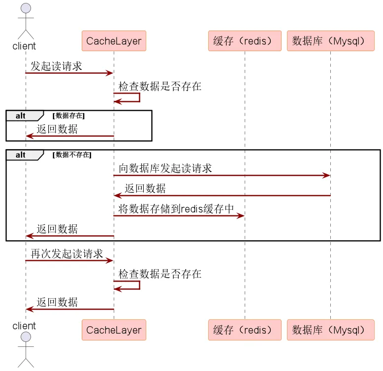

## Write-Through（写穿透）

Write-Through 是一种在缓存中更新数据时，同时将更新操作同步到持久化存储的策略。

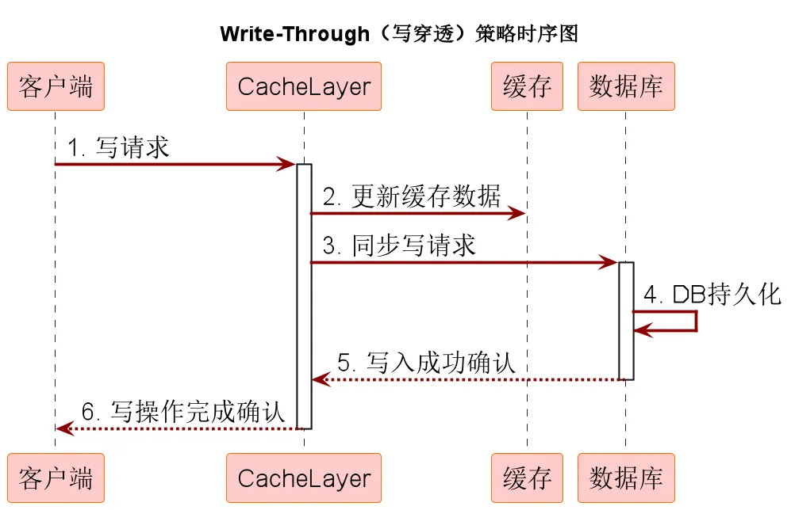

## Write behind（异步缓存写入）

也称为Write Back（回写）或异步更新策略，是一种在处理缓存与持久化存储（如数据库）之间数据同步时的策略。

在这种模式下，当数据在缓存中被更新时，并非立即同步更新到数据库，而是将更新操作暂存起来，随后以异步的方式批量地将缓存中的更改写入持久化存储。

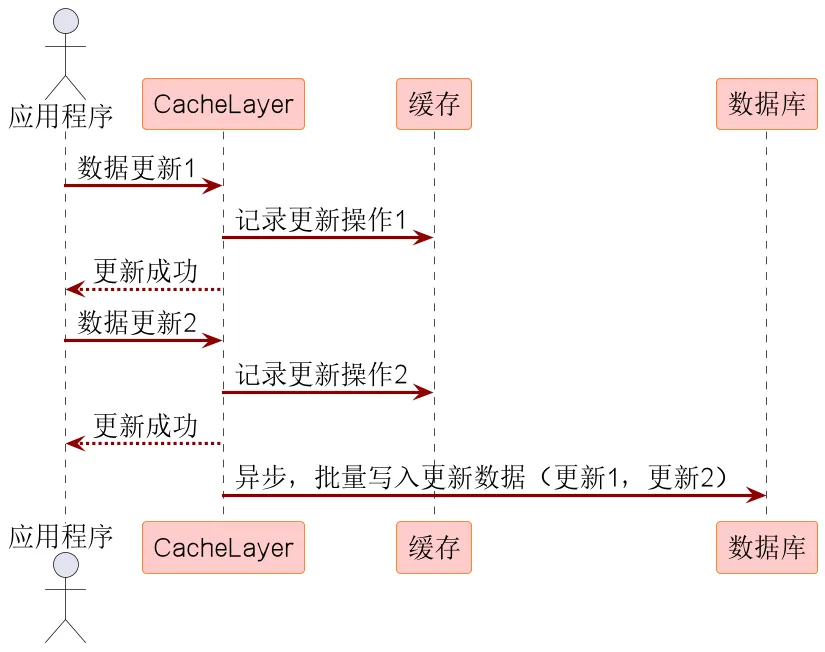

## Cache-Aside Pattern（旁路缓存模式）

又叫旁路路由策略，在这种模式中，读取缓存、读取数据库和更新缓存的操作都是在应用程序中完成。

Cache-Aside Pattern 是一种在分布式系统中广泛采用的缓存和数据库协同工作策略，在这个模式中，数据以数据库为主存储，缓存作为提升读取效率的辅助手段。

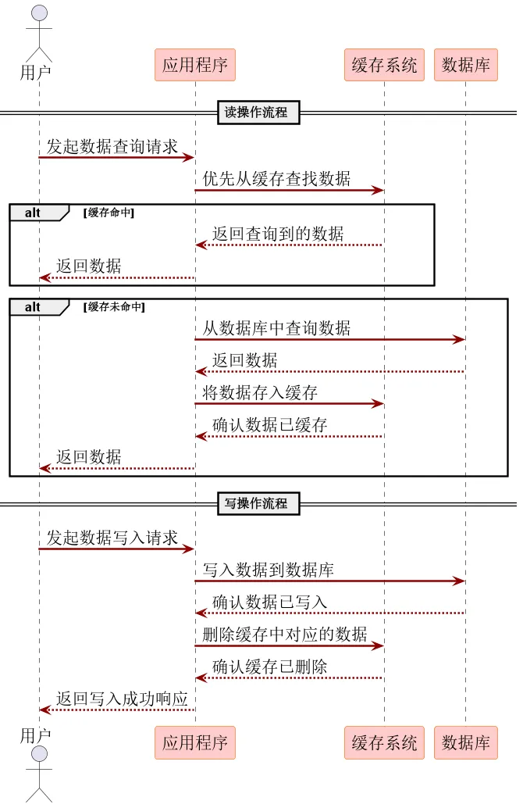

数据什么时候从数据库加载到缓存呢？

- 懒汉模式，在使用时临时加载缓存。
- 饿汉模式，提前预加载缓存。

### Cache-Aside在写入的时候，为什么是删除缓存而不是更新缓存呢？

Cache-Aside模式（旁路缓存模式）下的DB和Cache双写策略可以分为五大策略。

- 策略一：先更新数据库，再更新缓存
- 策略二：先删除缓存，再更新数据库
- 策略三：先更新数据库，再删除缓存
- 策略四：延迟双删策略
- 策略五：逻辑删除策略
- 策略六：先更新数据库，再基于队列删除缓存

#### 先更新数据库，再更新缓存

流程如下：

1. ProviderA更新数据库；
2. ProviderB更新数据库；
3. ProviderB更新缓存；
4. ProviderA更新缓存。

按照上面的流程，DB中的数据是ProviderB的数据，Cache中的数据是ProviderA的数据，出现DB和Cache数据不一致的问题。缓存中的数据为脏数据。

#### 先删除缓存，再更新数据库

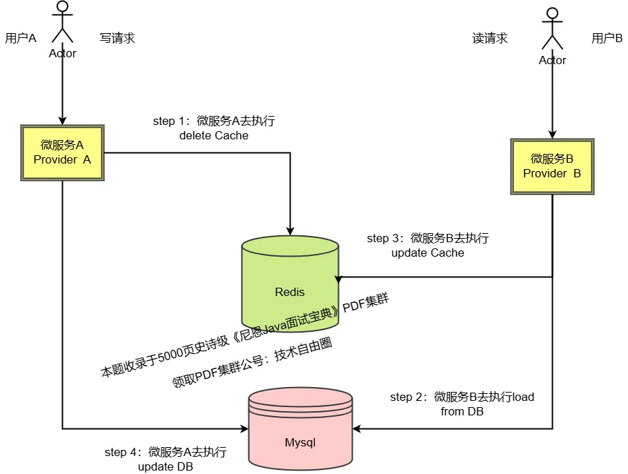

流程如下：

1. ProviderA删除缓存；
2. ProviderB查询数据库；
3. ProviderB更新缓存；
4. ProviderA更新数据库。

按照上面的流程，DB中的数据是ProviderA的数据，Cache中的数据是ProviderB从DB中加载的数据，而该数据已经过时，出现DB和Cache数据不一致问题。

#### 先更新数据库，再删除缓存

先更新数据库，再删除缓存，基本可以解决“并发读写”场景Cache和DB不一致的问题。

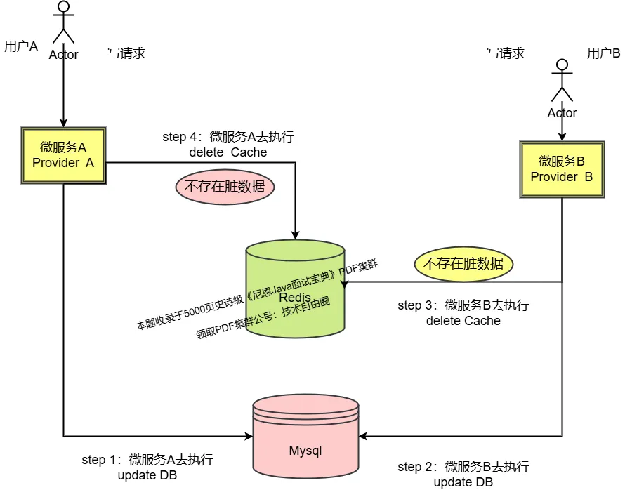

流程如下：

1. ProviderA更新数据库；
2. ProviderB更新数据库；
3. ProviderB删除缓存；
4. ProviderA删除缓存，不存在。

但在特殊场景下，还是会存在数据不一致的问题。

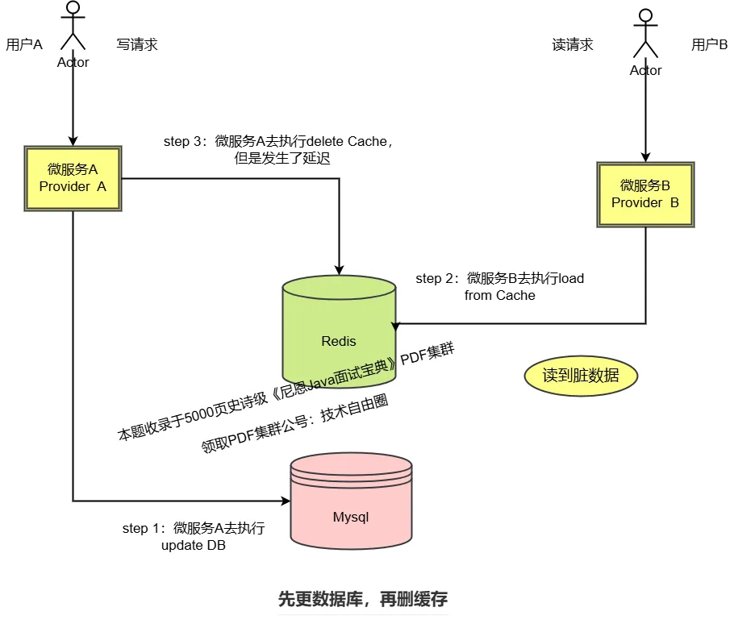

微服务ProviderA进行数据写入操作，先写DB，再删Cache，但是因为某种原因出现了卡顿，没有及时删除数据，此时ProviderB进行了一个数据的读取操作，先读Cache，在读DB，导致了DB和Cache数据的不一致。

#### 延迟双删

先删Cache，后写DB，延迟一定时间，再次删除Cache。

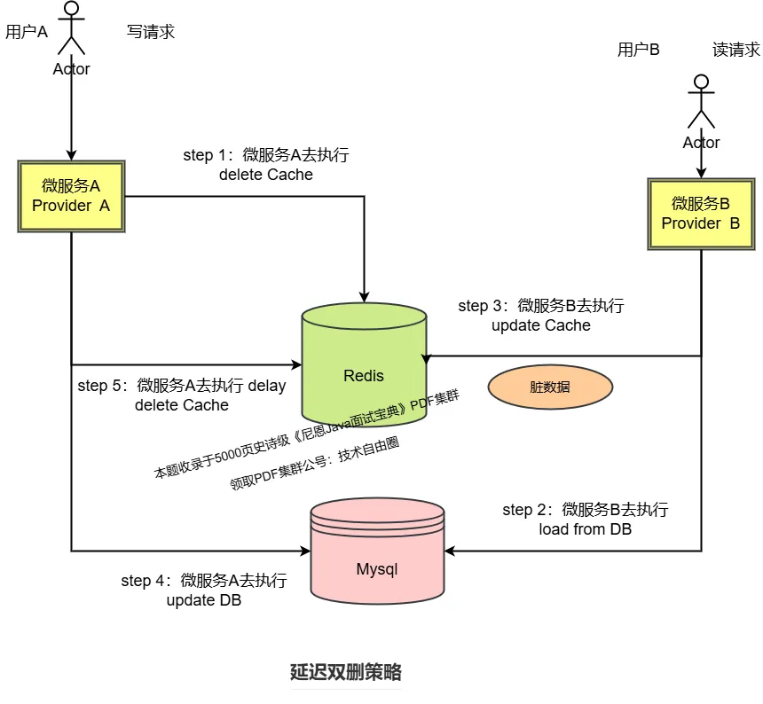

流程如下：

1. ProviderA删除缓存；
2. ProviderB查询数据库；
3. ProviderB更新缓存；
4. ProviderA更新数据库；
5. ProviderA删除缓存；

实现步骤：

1. 第一次删除缓存：在更新数据库之前，先删除缓存中的相关数据。可以避免在更新数据库期间，有其他线程读取到旧的缓存数据。
2. 更新数据库：执行数据库的更新操作，将新数据写入到数据库中。
3. 延迟：等待一段时间，确保在更新数据库后，所有可能读取旧数据的请求都已经完成。
4. 第二次删除缓存：经过延迟时间后，再次删除缓存中的相关数据，为了防止在延迟期间有其他线程将旧数据重新写入缓存。

**优点**：

1. 提高数据一致性：通过两次删除缓存和中间的延迟操作，能够在一定程度上减少缓存和数据库数据不一致的情况，提高系统数据一致性。
2. 实现相对简单：不需要引入过多的复杂逻辑和组件。

**缺点**：

1. 延迟时间不好确定：如果时间过短，可能无法保证所有读取旧数据的请求都已经完成；如果时间过长，会影响系统的性能和响应时间。
2. 多次删除性能低：会对Redis造成一定的压力。
3. 如果第二次删除失败，会长时间不一致。

删除策略：

1. 异步删除
    - 在更新数据库时，不立即删除缓存，而是将删除缓存的操作放入异步队列中，由专门线程或进程在后台异步执行。可以避免因同步删除缓存而导致的数据库事务阻塞，减少数据库操作的响应时间。
    - 优势：能显著提高系统的并发处理能力。数据库可以快速响应写入操作，而不必等待缓存删除完成，从而提高系统吞吐量。
2. 逻辑删除
    - 并不真正从缓存中删除数据，而是通过设置一个逻辑标志来表示数据是否被删除。当查询缓存时，先判断逻辑标志位，如果标志位表示数据已被删除，则不返回该数据，视为缓存中不存在该记录。
    - 优势：避免了实际删除操作带来的性能开销，尤其是在缓存数据量较大且删除操作频繁的情况下，逻辑删除不需要进行物理数据的删除和内存空间的重新整理，能有效提高缓存的访问性能。对于一些需要频繁恢复已删除数据的场景，只需要修改标志位，而无需从数据库重新加载数据到缓存。

局限性：

- 异步删除可能会导致缓存数据在短时间内不一致，需要通过一些补偿机制或定期校验来解决。
- 逻辑删除会使缓存中存在一些无效数据，占用一定内存空间，需要定期进行清理或采用更复杂的缓存淘汰策略来管理。

#### 逻辑删除

在缓存数据中添加字段（如logicExpireTime），表示业务有效期。写入缓存时设置逻辑过期时间，和较长物理TTL。

异步重建：查询时若发现逻辑过期，触发异步线程更新数据，期间仍返回旧数据，避免缓存击穿。

数据查询流程：读取缓存时，先检查logicExpireTime，未过期直接返回数据；已过期触发异步重建（通过消息队列或线程池），并返回旧数据。

异步重建流程：

- 加锁防并发：使用互斥锁（如Redis的SETNX），确保仅一个线程重建，避免数据库压力。
- 更新缓存：从数据库获取最新数据，更新缓存并充值logicExpireTime和物理TTL。

数据更新流程：业务数据变更时，直接更新缓存并重置逻辑过期时间，或标记为过期（logicExpireTime=当前时间），强制下次查询触发重建。

**优势**：

- 高可用性：逻辑过期期间仍返回旧数据，避免缓存雪崩。
- 减少延迟：异步重建不阻塞用户请求。
- 资源优化：物理过期兜底，防止内存泄漏。

**注意事项**：

- 短暂不一致：异步重建期间可能返回旧数据，需业务容忍。
- 重建失败：需重试机制或告警，确保数据最终一致。
- 锁竞争：分布式锁需设置合理超时，避免死锁。
- 冗余时间设置：根据业务峰值调整，平衡内存占用与重建压力。

**适用场景**：

- 高并发读场景：如热点商品信息、秒杀活动。
- 允许最终一致性：如资讯类、非实时统计数据。
- 频繁更新数据：需结合主动更新策略减少重建延迟。

#### 先更新数据库，再基于队列删除缓存

1. 基于内存队列
    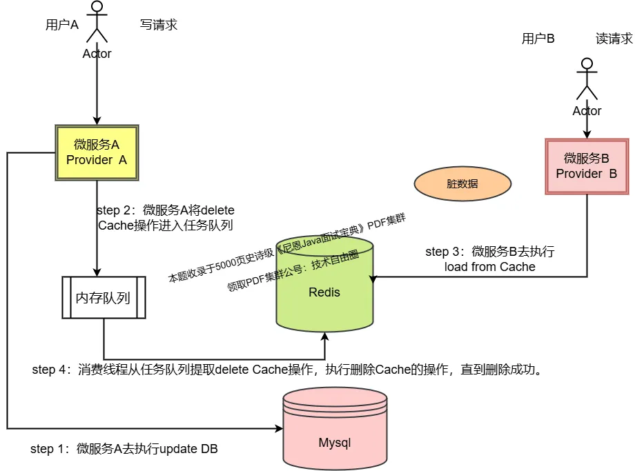

    微服务ProviderA先写DB，再将删除Cache操作加入任务队列。在删除Cache操作真正执行完成之前，其他的数据读取操作，都会读取Cache中的过期数据，出现DB和Cache数据不一致问题。但是这种不一致是暂时的。

2. 基于消息队列
    

    ProviderA将删除Cache的操作，序列化成消息队列消息，然后写入高可用消息队列中间件即可。

3. 基于binlog+消息队列删除缓存
    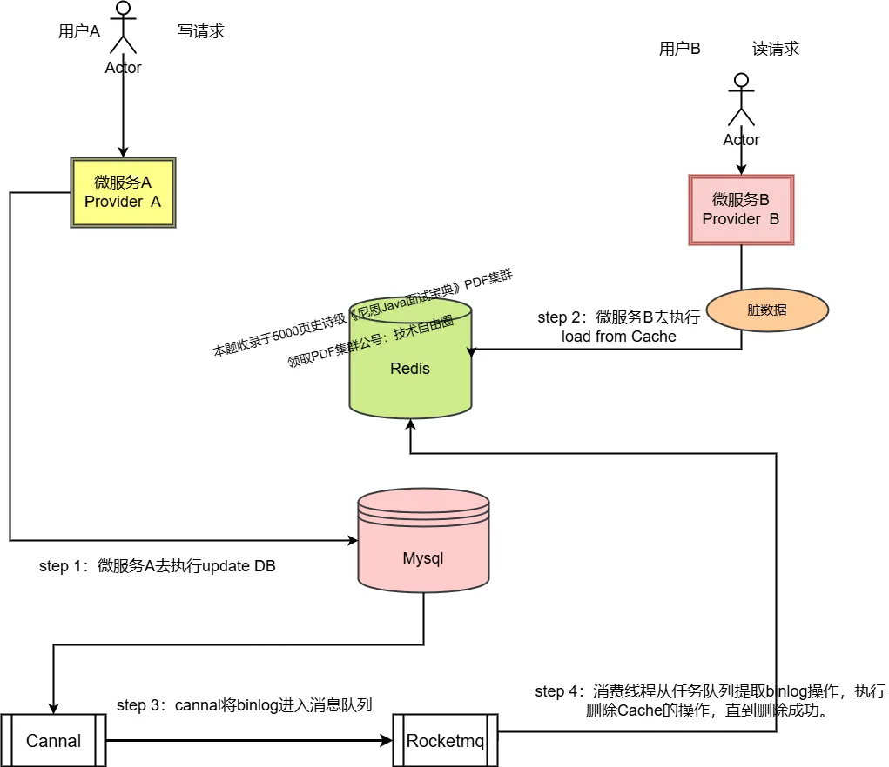

    可以使用阿里的Canal中间件，采集在数据写入MySQL时生成的binlog日志，Canal将日志发送到消息队列。编写一个专门的消费者完成缓存binlog日志订阅，筛选出其中的更新log，解析后进行对应的Cache删除操作，再通过消息队列ACK机制确认处理这条更新log，保证Cache删除能够得到最终删除。

#### 最终一致性方案

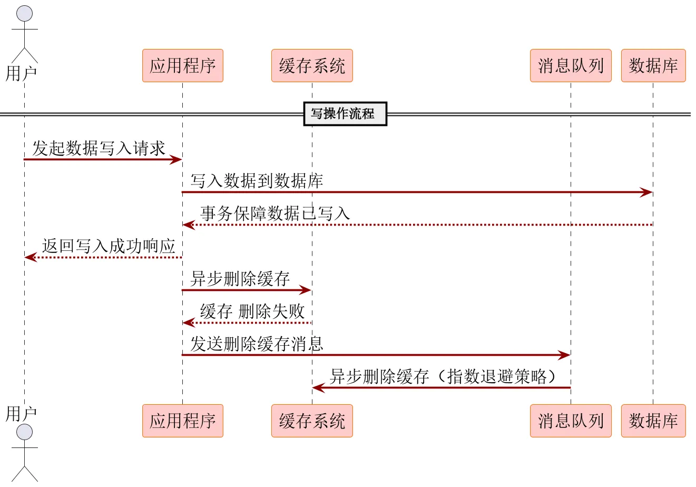
